# SARS-CoV-2 training with galaxy

In this report you will find all the information necessary to follow the steps to analyze SARS-CoV-2 data with Galaxy.

## Training overview
During this training we will following these steps:
* [Register/Login](#register/login): Register or login into Galaxy website.
* [Data](#data): Upload data for the analysis.
* [Quality](#quality): Analysis of the quality of the raw reads.
* [Trimming](#trimming): Quality trimming using fastp
* [Mapping](#mapping): Mapping reads to reference genome with Bowtie2
* [Stats](#stats): Mapping statistics with samtools and picard.
* [Amplicons](#amplicons): Preprocessing steps mandatory for amplicon sequencing data.
* [Variants](#variants): Variant calling and filtering.
* [Consensus](#consensus): Consensus genome generation

## Register/Login

First of all, you have to create a user (or login into your user if you already have one) in the [Galaxy website](https://usegalaxy.org/) by clicking in the button indicated in the image:

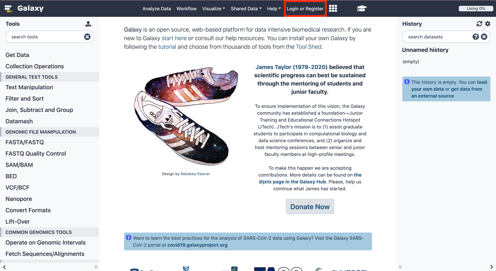

You can do this analysis without creating a user, but your history will be saved into your user so you can access later at home.

Once you are registered we can start with the analysis workflow.

**_From now on, each job we run in Galaxy will have a unique number for identifying each process. This numbers can differ depending on the number of samples and the times you run or delete any process. This training's snapshots were taken using two samples and some process were deleted for any reason, so numbers MAY DIFFER. Also, this exercise's snapshots were taken with other dataset, so sample names may differ too._**

## Data

Before starting with any analysis we have to upload de data we want to analyze into galaxy. The are three different ways to upload data to Galaxy, from which we will explain you some of them along this training.

### Uploading data from URL
In order to do upload files from URL we have to follow these steps:

1. In the left side panel, select **Upload Data**
2. In the new panel select Paste/Fetch Data
3. Then copy the following block of text:

```
https://zenodo.org/record/5718923/files/SARSCOV2-1_R1.fastq.gz?download=1
https://zenodo.org/record/5718923/files/SARSCOV2-1_R2.fastq.gz?download=1
```

4. Now, in the **Download data from the web by entering URLs (one per line) or directly paste content.** square, paste the text you copied before
5. Select **Start**
6. When everything is green in the screen, select *Close*

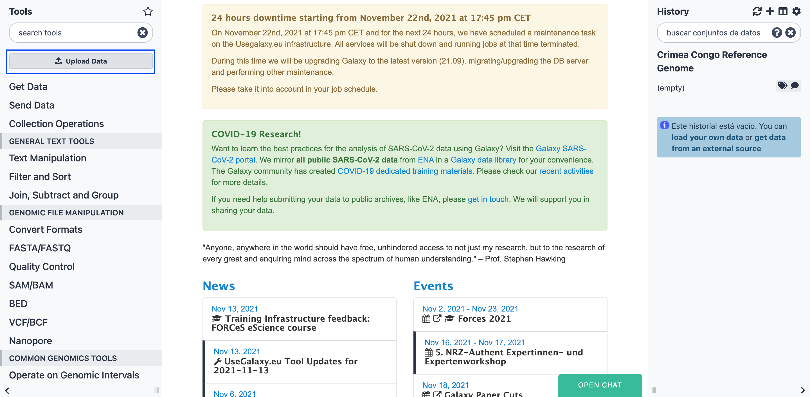
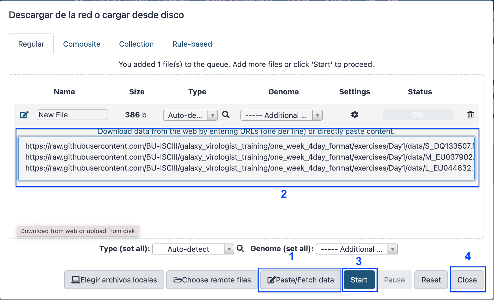

Once files are uploaded we can close the window clicking on "_close_" button. Both files will appear in the right panel.

## Quality

### Quality Analysis (FastQC)

Once we have the raw data, an important step is to analyze the quality of the reads, to know if the reads are worth it. To do this, we have to:

1. Search for the **fastqc** tool and select **FastQC Read Quality reports** and set the following parameters:
2. Select multiple file data set in Raw read data from your current history
3. With the *Ctrl* key pressed, select the two datasets
4. Then go down and select **Execute**

<p align="center">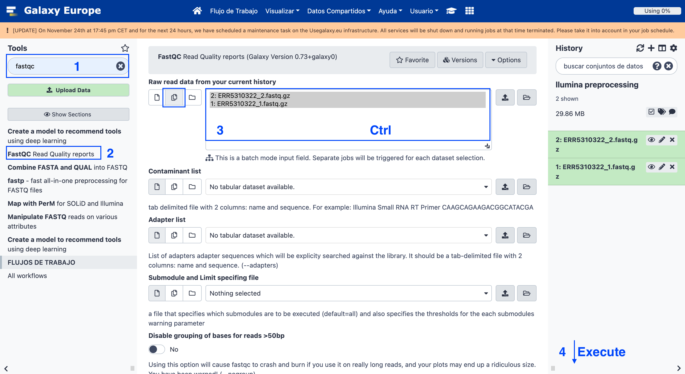</p>

**This is for the case that you used two samples instead of one like in this training"***

This program will generate a message like this one, were we can read that, each .fastq file is going to generate two different jobs, one for the Raw Data and another one for the .HTML report.

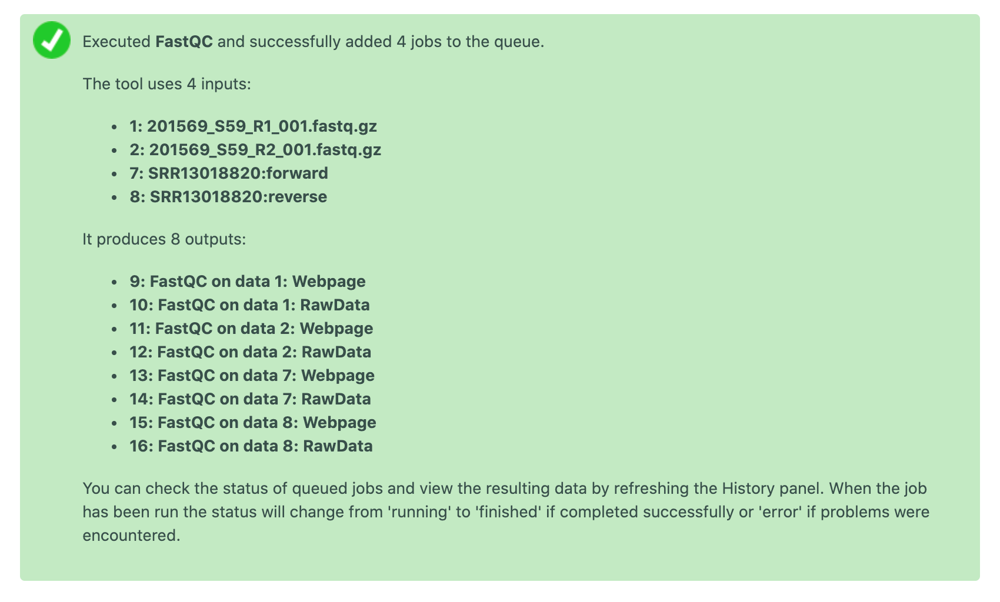

### FastQC results visualization
To visualize the information coming from FastQC we just have to select the job of interest. In this case we are interested in the "_Web page results_" so for the sample we want to see the results we have to click in the _eye_ to visualize galaxy results:


This report gives different type of information about the sequencing quality of the reads. Clicking in the arrows in the bottom right/left corners of the page we can hide/show the side panels.

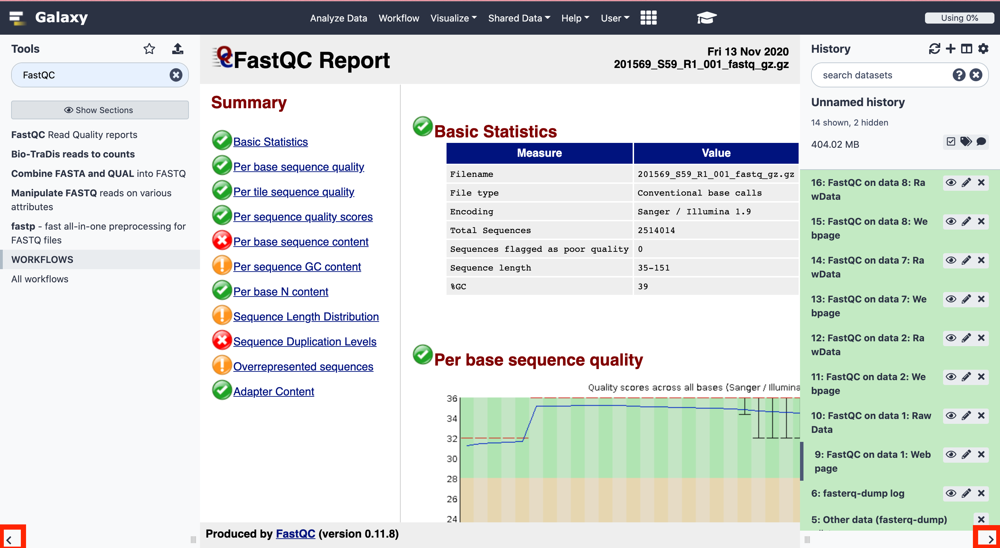

So the central panel with the results we want to visualize will bee better seen.


**_For more information about FastQC output visit [FastQC website](https://www.bioinformatics.babraham.ac.uk/projects/fastqc/Help/3%20Analysis%20Modules/)_**

## Trimming

### Quality trimming (Fastp)
Once we have check the quality of our reads, it's important to trim low quality nucleotides from those reads, for which we will use _Fastp_. So, in the search bar you look for fastp and then select "_fastp - fast all-in-one preprocessing for FASTQ files_". There, we will have to change some parameters ensure the trimming accuracy for this amplicon data. First of all we are going to do the analysis for the sample we gave to you (201569). These are the field we will have to change:

3. Single-end or paired reads > Paired
4. Input 1 > Browse datasets (right folder icon) > Select 201569_S59_R1_001.fastq.gz
    Input 2 > Browse datasets > Select 201569_S59_R2_001.fastq.gz
6. Display Filter Options
  6. Quality Filtering options
    7. Qualified Quality Phred = 30
    8. Unqualified percent limit = 10
  9. Length Filtering Options
    10. Length required = 50
11. Read modification options
  12. PoliX tail trimming > Enable polyX tail trimming
  13. Per read cutting by quality options
    14. Cut by quality in front (5') > Yes
    15. Cut by quality in tail (3') > Yes
    16. Cutting mean quality = 30
17. Output options
  18. Output HTML report > Yes
  19. Output JSON report > Yes

Finally, click on "_Execute_"

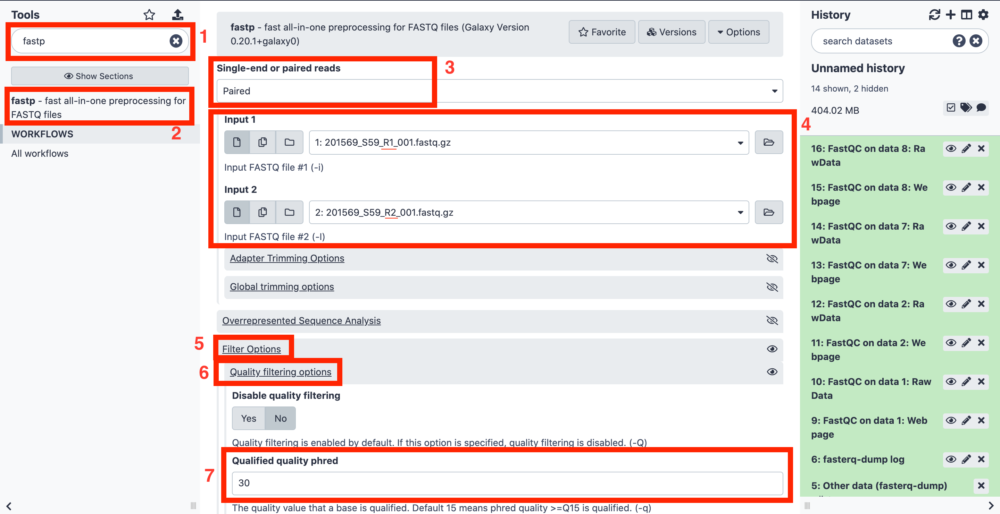
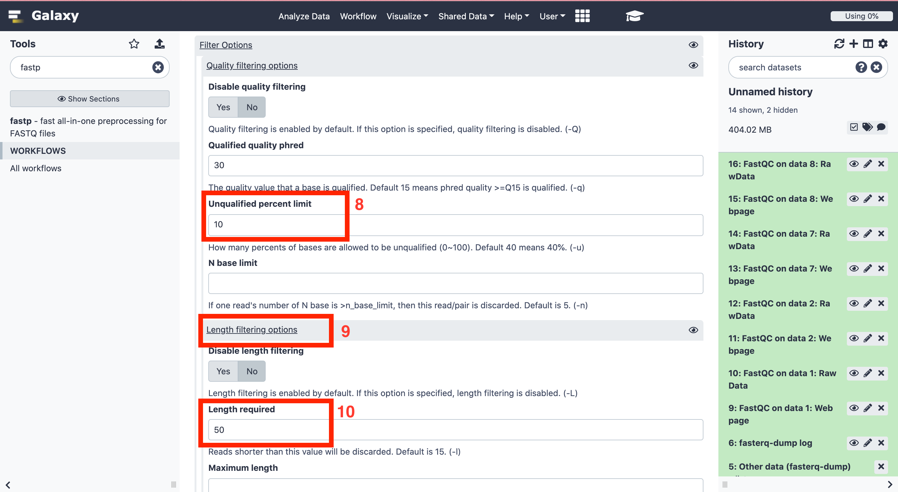
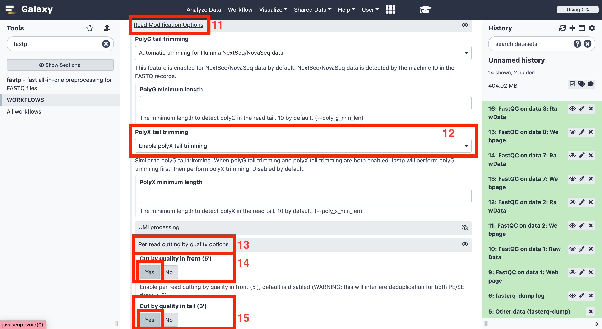
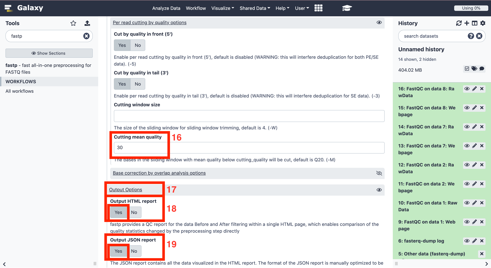

A message like this one will appear, which means that 4 results will be generated:
  1. One with the R1 trimmed reads
  2. Another one with the R2 trimmed reads
  3. Another one with the HTML results
  4. A last one with the JSON results

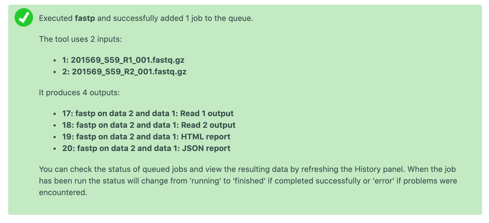

### Fastp results

Once fastp analysis is done, you can see the results by clicking in the eye ("_View Data_") in the fatp HTML results. We will see a report like this one:

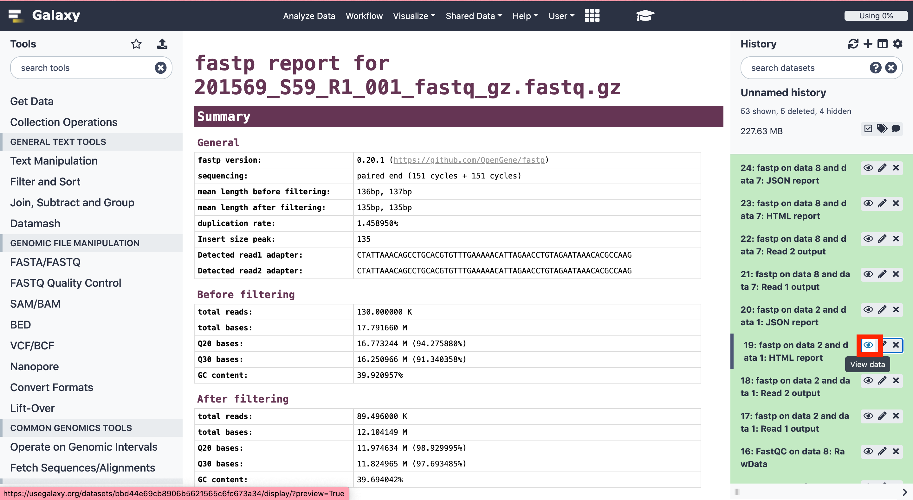

This report can be downloaded by clicking in the results name ("_fastp on data 2 and data 1: HTML report_") and then in "_Download_".


This will download a .zip folder that contains the .html report, that can be visualize in your computer using any browser (such as Google Chrome) and interactively scroll around the results.

Among the most relevant results, you have the:

- Summary: Stats summary
  - After filtering: Statistics of the reads after quality filtering
    - reads passed filters: Reads remaining after quality filter trimming
    - reads with low quality: Reads that were remove due to low quality
    - reads too short: Reads that didn't pass the minimum length filter.
  - After filtering: Plots after filtering
    - After filtering: read1: quality: Plot with the evolution of R1 quality over read position. Usually it decays in the last nucleotides.
    - After filtering: read2: quality: Same plot for R2.

**_For more information about FastQC output visit [Fastp github](https://github.com/OpenGene/fastp)_**

## Mapping

In order to call for variants between the samples and the reference, it's mandatory to map the sample reads to the reference genome. To do this we need the fasta file of the reference and the Bowtie2 index of that fasta file.

### Reference genome for mapping

Prior to any analysis, we have to download the fasta reference genome, and we are going to do it using the following URL:

```
https://github.com/nf-core/test-datasets/raw/viralrecon/genome/NC_045512.2/GCF_009858895.2_ASM985889v3_genomic.200409.fna.gz
```

So you have to copy the URL direction, and do then select "_Download from web or upload from disk_", the select "_Paste/Fetch data_" and in the new window that appears you should paste the URL above and finally select "_Start_". Now the fasta file of the reference is download.

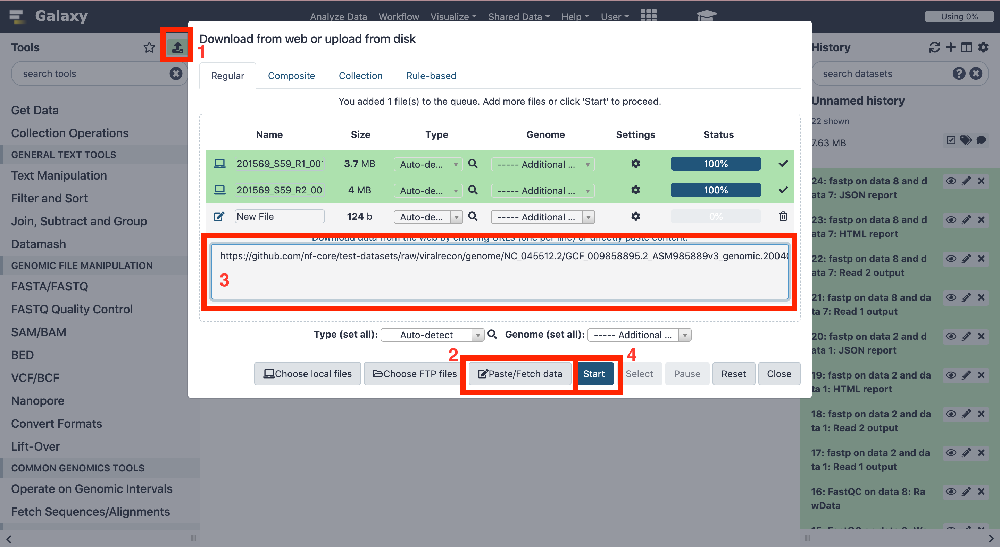

### Mapping reads with reference genome (Bowtie2)

Now we can start with the main mapping process. The first thing we have to do is look for the program "_Bowtie2_" in the search bar and then select "_Bowtie2 - map reads against reference genome_". Here we will have to set the following parameters, for the first sample:

3. Is this single or paired library > Paired-end
4. Fasta/Q file #1: **fastp on data 2 and data 1: Read 1 output**
5. asta/Q file #2: **fastp on data 2 and data 1: Read 2 output**
6. Will you select a reference genome from your history or use a built-in index? > Use a genome from the history and create index
  - **This is very important because we haven't previously created the SARS-Cov2 genome index, si bowtie 2 will generate it automatically.**
7. Select reference genome > https://github.com/nf-core/test-datasets/raw/viralrecon/genome/NC_045512.2/GCF_009858895.2_ASM985889v3_genomic.200409.fna.gz
  - It's important to select the file we downloaded from URL.
8. Do you want to use presets? > Very sensitive local
9. Save the bowtie2 mapping statistics to the history > Yes
10. Execute

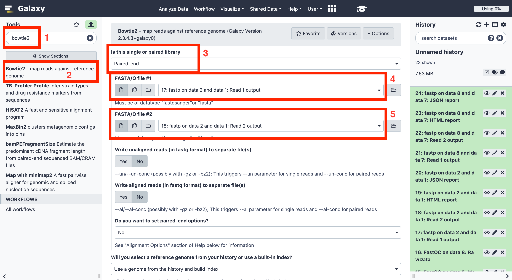
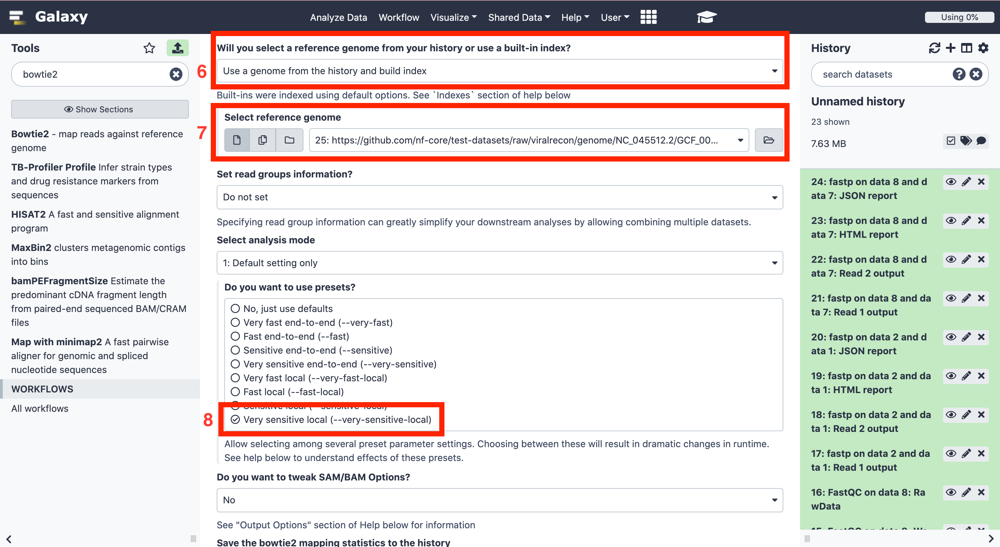
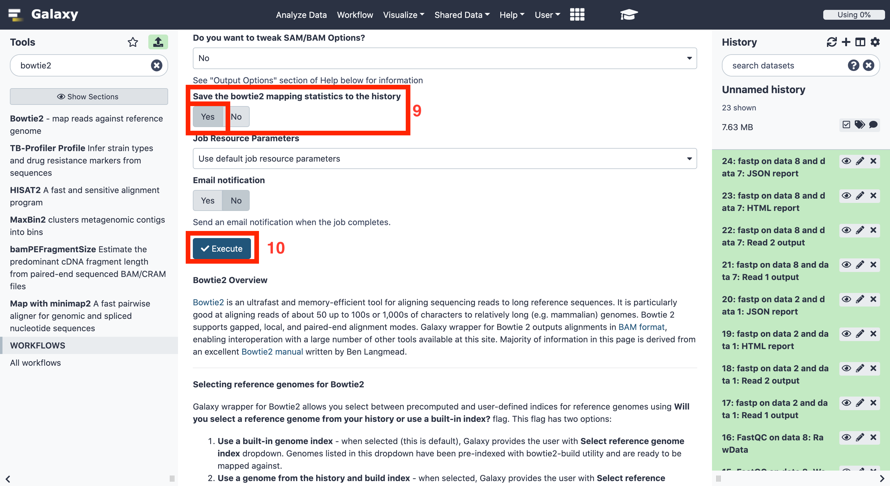

We will see a message like this one:

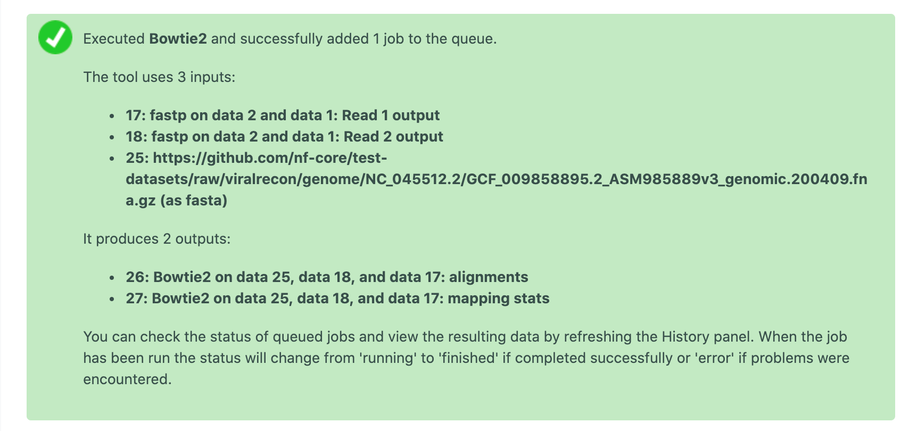

### Mapping results

Now we can see the mapping results for the samples. The bowtie2 resulting file is a .bam file, which is not easy to read by humans. This .bam file can be downloaded by clicking in the alignment file and then into download. Then, the resulting .gz file will contain the alignment .bam file that can be introduced in a software such as [IGV](http://software.broadinstitute.org/software/igv/) with the reference genome fasta file.

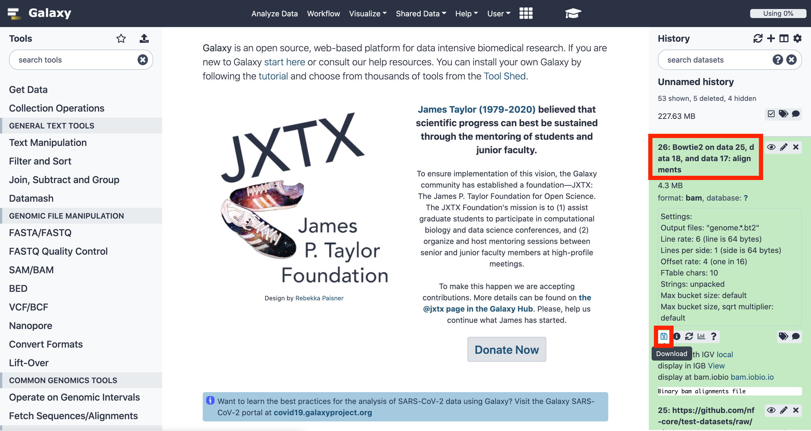

In our case, the file that can be visualize is the statistics file, which contains information such as the percentage of reads that aligned.

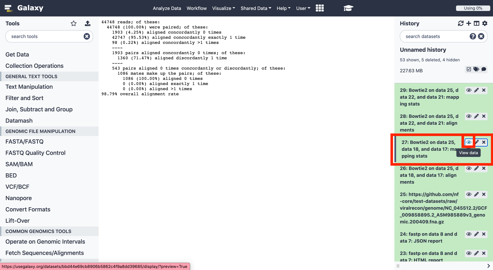

## Stats

The previously shown files give few human readable information, because mapping files are supposed to be used by other programs. In this sense, we can use some programs to extract relevant statistical information about the mapping process.

### Samtools flagstat

The first program is Samtools, from which we will use the module samtools flagstat. To do this, we have to look in the search bar for "_samtools flagstat_" and then select "_Samtools flagstat tabulate descriptive stats for BAM datset_". There, we just have to select the samples we want to perform the mapping stats (in the example there are two samples, you just have to use one): _Bowtie2 on data X, data X and data X: alingment_. You can select the samples from the list in _Multiple datasets_ or select the folder icon (_Browse datasets_) to select the file from the history. Finally, select _Execute_

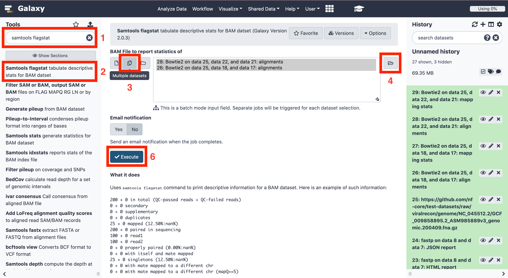

### Samtools results

The results of the samtools program gives information about the number and percentage of reads that mapped with the reference genome.

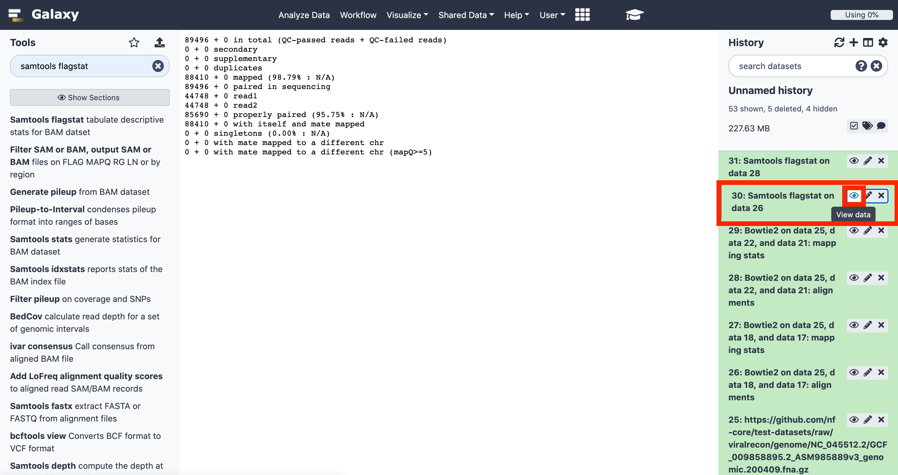

### Picard CollectWgsMetrics

Another program that gives statistical information about the mapping process is Picard. To run this program you just have to search "_Collect Wgs Metrics_" and then select "_CollectWgsMetrics compute metrics for evaluating of whole genome sequencing experiments_".

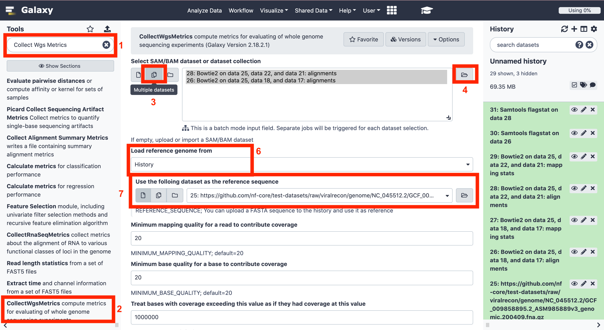

In "_Select SAM/BAM dataset or dataset collection_" you can select more than one .bam alignment file by clicking in the folder icon "_Browse dataset_"(4).

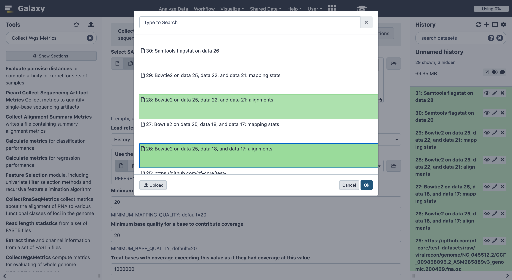

The you have to change the following parameters:

6. Load reference genome from > History
7. Select the fasta file we uploaded with the reference genome (https://github.com/nf-core/test-datasets/raw/viralrecon/genome/NC_045512.2/GCF_009858895.2_ASM985889v3_genomic.200409.fna.gz).
8. Treat bases with coverage exceeding this value as if they had coverage at this value = 1000000
9. Select validation stringency > Lenient
10. Execute.

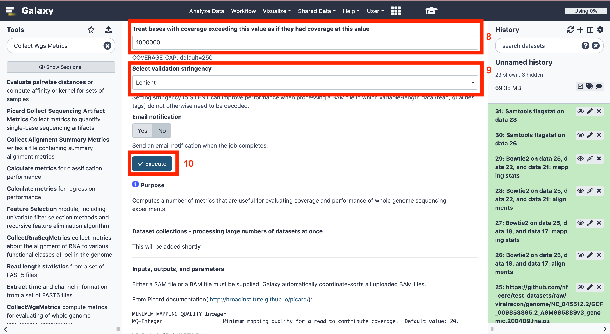

This process will generate one output file per .bam alignment file selected as input.

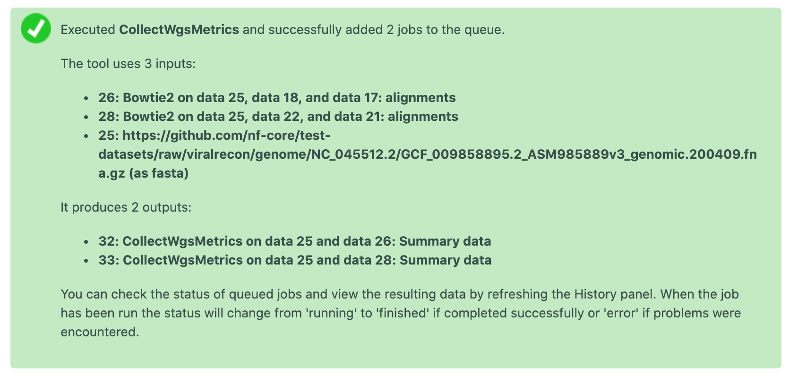

### Picard results

Picard results consist in quite long files, so the best is to download those results and visualize them in your computer. Yo you have to click in the CollectWgsMetrics job you want to download, and then click in the save button:


Then you just have to open the file with Excell in your computer, and you will see a file with different columns with information about the percentage of the reference genome that is covered by the reads at a specific depth or the mean depth of coverage of the reference genome.

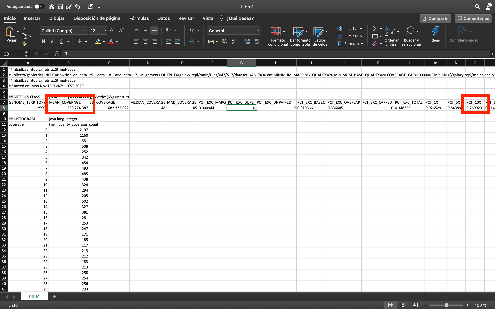

So in the results table you can see that the "Mean Coverage" is around 200, which means that each position in the reference genome is supported by 200 reads, by mean. The "PCT 10X" represents the percentage of the reference genome that is sequence with a 10X depth, which represents the percentage of the reference genome that is at least sequenced 10 times (76,99%).

## Amplicons

After mapping the reads to the reference genome, we are interested in removing the sequences of the amplicon primers. To do that you will use a program called iVar, and you will need a bed file with the positions of those amplicon primers.

### Download amplicon bed file

First you will download the bed file of the amplicon primers, which contains the positions in the reference genome of each of the amplicon primers. You have to click in "_Download from URL or upload files from disk_", then select "_Paste/Fetch data_" and then paste this URL in the window:
https://raw.githubusercontent.com/nf-core/test-datasets/viralrecon/genome/NC_045512.2/amplicon/nCoV-2019.artic.V3.scheme.bed

Finally, press "_Start_".

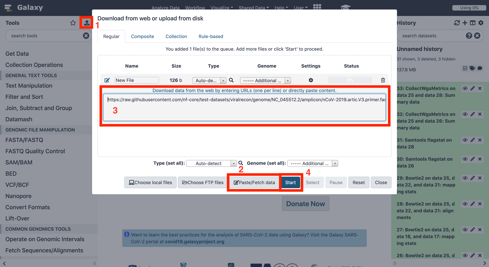

### Trim amplicon sequences

Once you have the bed file, you just have to search for "_ivar trim_" in the search bar and select "_ivar trim Trim reads in aligned BAM_". Then follow these steps:

3. Bam file > Select the aligment bam file generated with Bowtie2.
4. BED file with primer sequences and positions > Select the bed file you just upload.
5. Minimum length of read to retain after trimming = 20
6. Include reads not ending in any primer binding sites? > Yes.

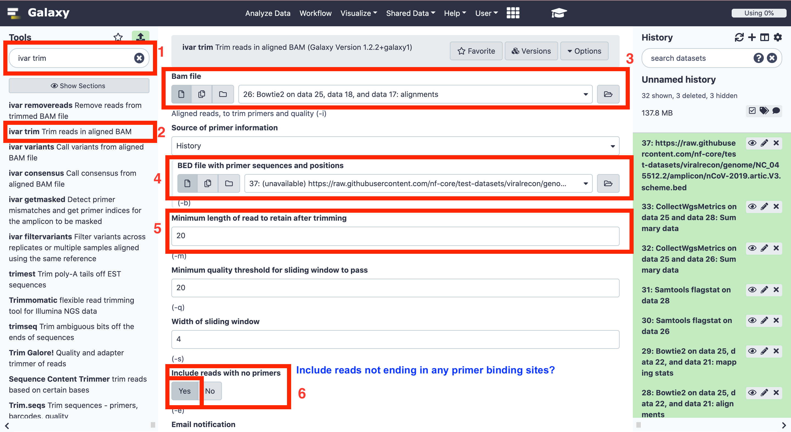

### iVar results

The resulting file from iVar will be a new BAM file where amplicon primer positions will be removed, so there's no result to visualize.

## Variants

Once we have the alingment statistics and files with amplicon primers trimmed, we can start with the variant calling process.

### Mpileup

The first step in variant calling is generated a pileup file. For that you just have to search for "_mpileup_" in the search bar and select "_samtools mpileup multi-way pileup of variants_". Then select the following parameters:

3. Choose the source for the reference genome > Use a genome from the history.
4. BAM file(s) > Select the ivar bam file
5. Using reference genome > Select the reference fasta file.
- Set advanced options > Advanced
6. Disable read-pair overlap detection > Yes
7. Do not discard anomalous read pairs > Yes
8. Disable BAQ (per-Base Alignment Quality), see below > Yes
9. max per-file depth; avoids excessive memory usage = 0
10. Minimum base quality for a base to be considered = 20
11. Execute

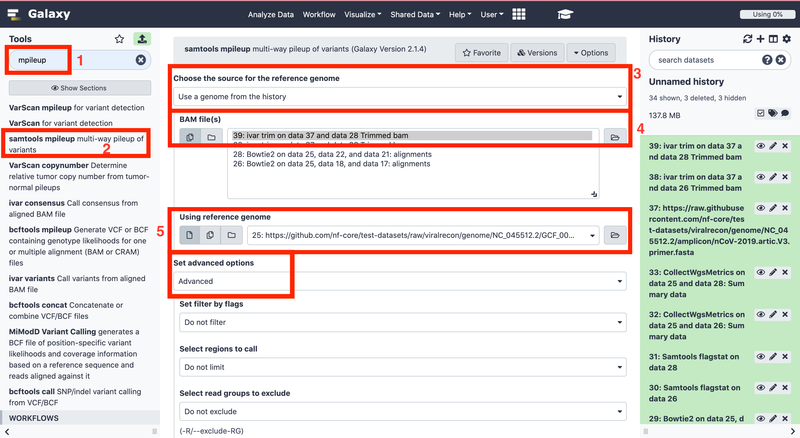
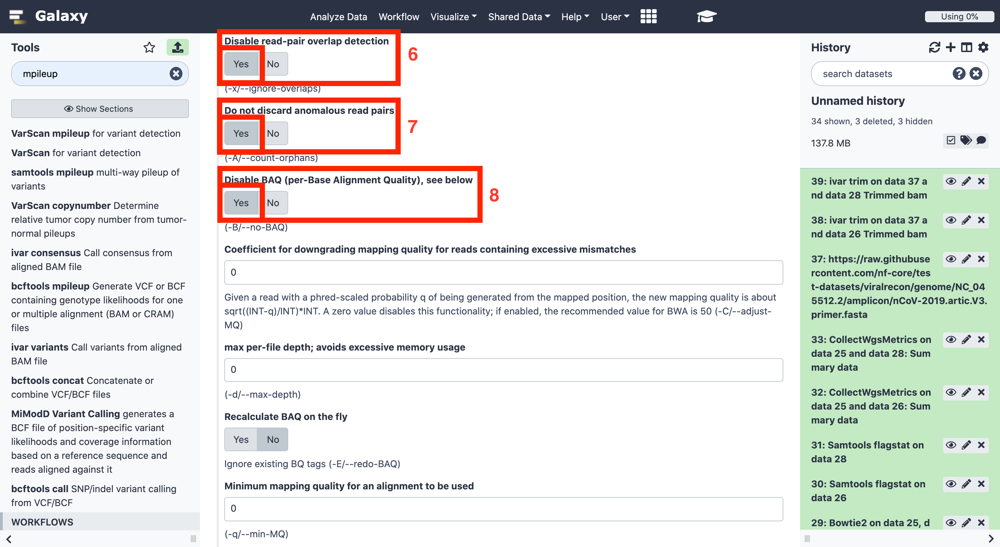
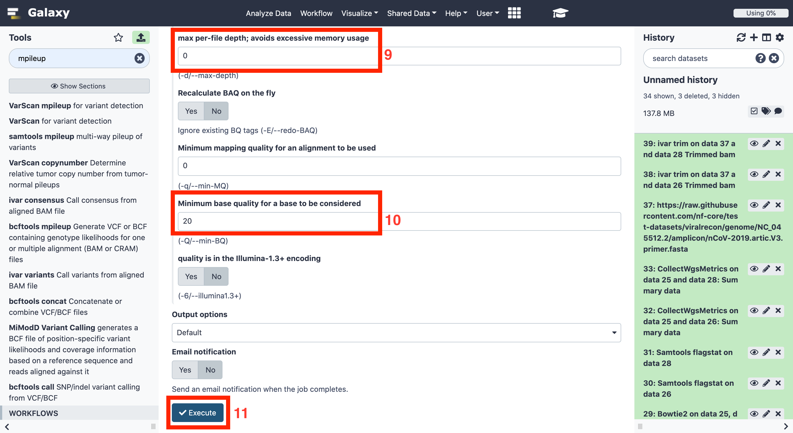

### VarScan

Now, with the mpileup file you can start the variant calling process. You will use a program called VarScan, so you have to search for "_varscan_" in the search bar and select "_VarScan for variant detection_". Then select the following parameters:

3. Pileup dataset > Select the mpilup file generated in the previous process.
4. Minimum read depth = 10
5. Minimum supporting reads = 5
6. Minimum base quality at a position to count a read = 20

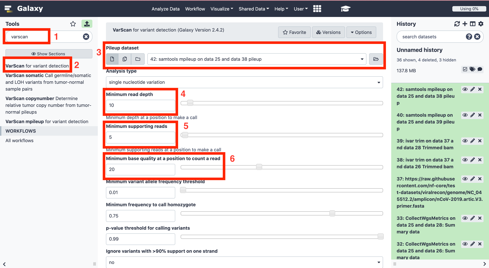

### VarScan results

VarScan results consist in a VCF file containing all the variants found between the reference and the sample. Each line represents a variant the columns give information about that variant, such as the position in the reference genome, the reference allele, the alternate allele, if that variant passed the filters, and so on.

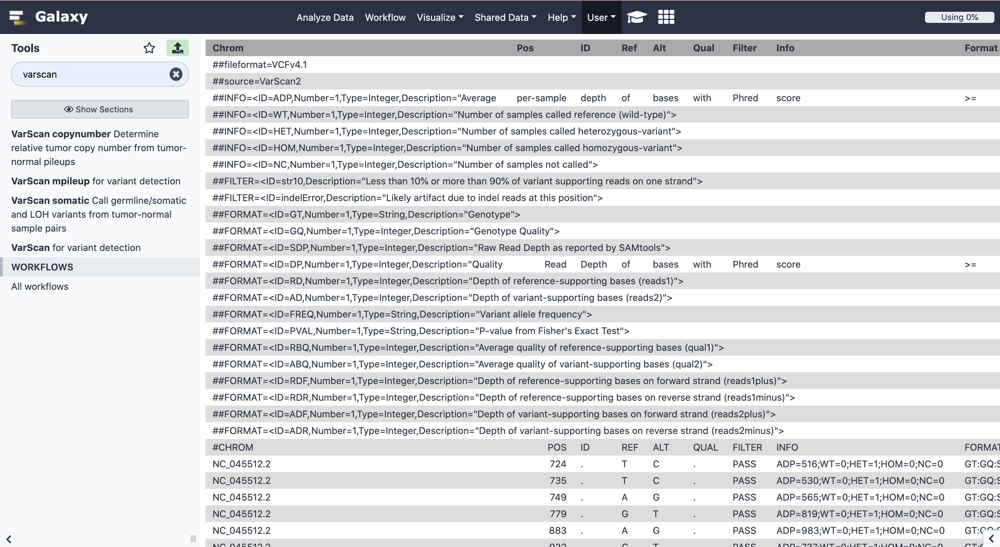

This variants have only passed a filter for the minimum quality if the variant, which we set as 20, but we need to filter these variants more.

### Variant Filtering with Bcftools

To filter the variants called by VarScan you will use a program called bcftools. You have to search for "_bcftools filter_", then select "_bcftools filter Apply fixed-threshold filters_" and then select the following parameters:

3. VCF/BCF Data > VCF file from VarScan
4. Restrict to > Select this to display more options:
  5. Include -> Write: **FORMAT/AD / (FORMAT/AD + FORMAT/RD) >= 0.8**
    - This is to select only those variants with an allele frequency higher than 80% which are the ones that can be considered as valid for the consensus genome.
6. output_type > Uncompressed VCF


### Bcftools filter results

The main difference between the VCF file from VarScan and the VCF from Bcftools is that this last one is shorter because it will only contain those variants with an allele frequency higher than 80%.

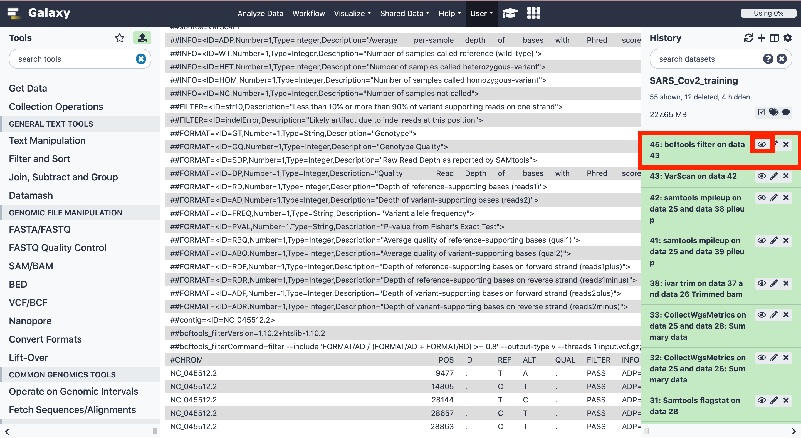

### Annotation with SnpEff

Once we have the variants called, it's interesting to annotate those variants, for which you will use SnpEff. Search for "_snpeff_" in the searh bar and select "_SnpEff eff: annotate variants for SARS-CoV-2_", then change the following parameters:

3. Sequence changes (SNPs, MNPs, InDels) > Select Bcftools filter output VCF.
4. Create CSV report, useful for downstream analysis (-csvStats) > Yes


### SnpEff results

The SnpEff gives three different results, from which the most interesting ones are:

1. Snpeff eff: Which is a VCF file with the annotation results. It is a very similar file to the ones we saw before for VarScan and Bcftools but with the last column different, containing relevant information about that variant.

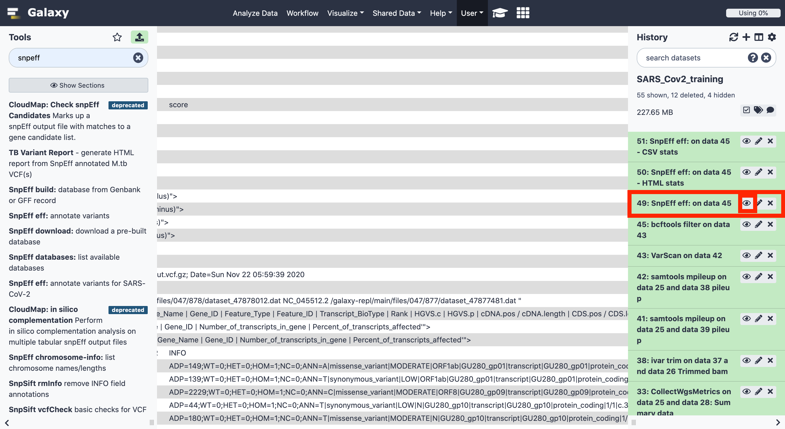

2. Snpeff eff CSV stats: This file is a CSV file that contains statistics about the variant annotation process, such as the percentage of variants annotated, the percentage of variants that are MISSENSE or SILENT, the percentage that have HIGH, MODERATE or LOW effect, and so on.

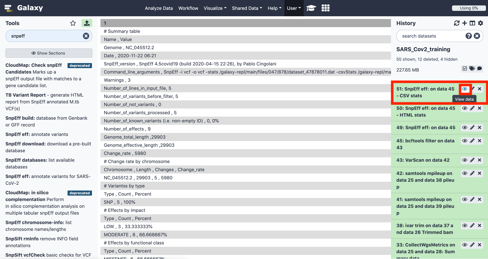

## Consensus
Once we have the most relevant variants that can be considered to include in the consensus genome, you can start with the consensus genome generation.

### Bcftools consensus

The first step consist in including the called variants into the reference genome, for which you will search for "_bcftools consensus_" in the search bar and then select "_bcftools consensus Create consensus sequence by applying VCF variants to a reference fasta file_". In this module you have to select:

3. VCF/BCF Data > VCF resulting from bcftools filter.
4. Reference genome > Fasta file uploaded at the begining.

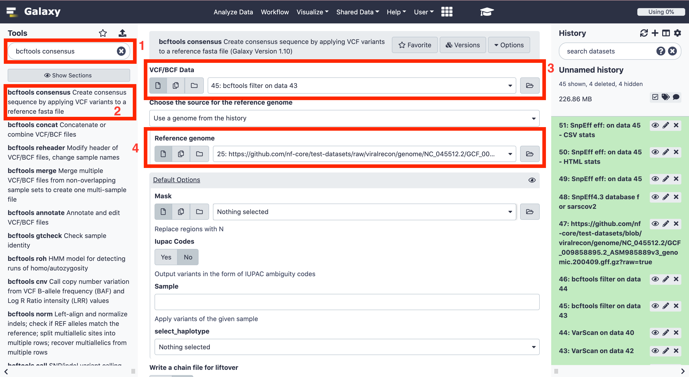

This will just generate a fasta file identical to the reference one, except for those nucleotides that are variants from the VCF file.


### Genome coverage calculation

At this point, we have the consensus viral genome, but we know that we have filtered the variants based on the coverage, selecting only those that had a coverage depth higher than 10X. So we cannot ensure that the consensus genome doesn't have any variant that we have filter in those regions with a coverage lower than 10X. So the next step is to determine which regions of the reference genome have a coverage lower than 10X.

To do that you will search for "_bedtools genomecov_" in the search bar and select "_bedtools Genome Coverage compute the coverage over an entire genome_", the you will have to select the following files:

3. Input type > BAM
  4. BAM file > Alignment file from bowtie2
5. Output type > BedGraph coverage file
6. Report regions with zero coverage > Yes

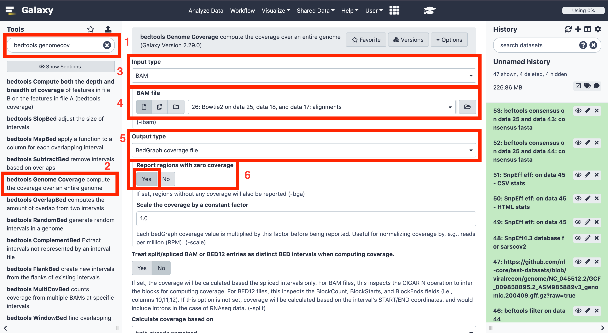

This process will generate a BED file where each genomic position range of the reference genome has the coverage calculated. In this example you can see that for the positions of the reference genome from the nucleotide 55 to 63 they have a coverage of 20X.

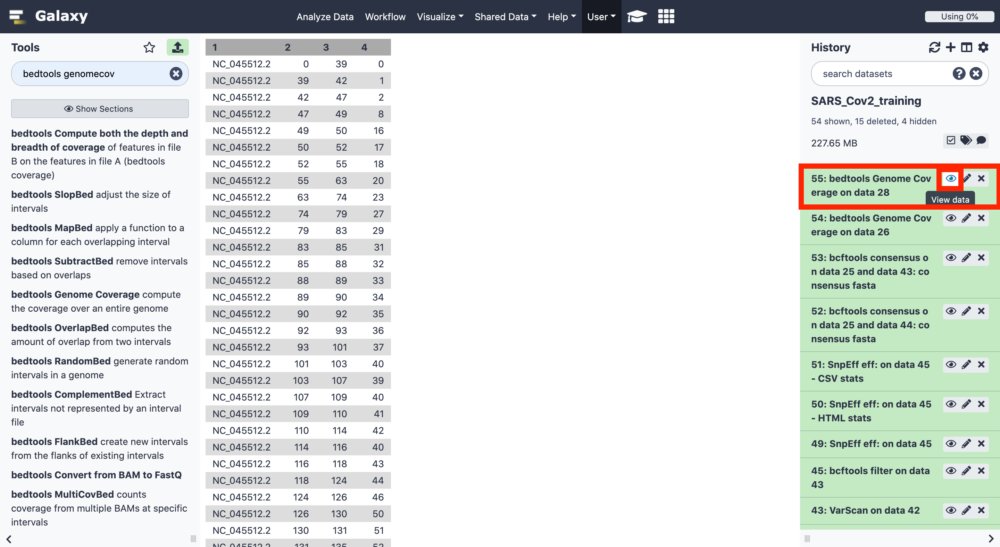

### Regions filtering

From this resulting file from betdools genomecoverage you are going to select those regions with a coverage lower than 10X. Writing in the search bar "_awk_" and selecting "_Text reformatting with awk_", you are going to change:

3. File to process > Bedtools genome coverage file with the coverage regions
4. AWK Program = $4 < 10
  - **This will filter all the lines (genomic regions) that have a value lower than 10 in the 4th column (coverage)**
5. Execute

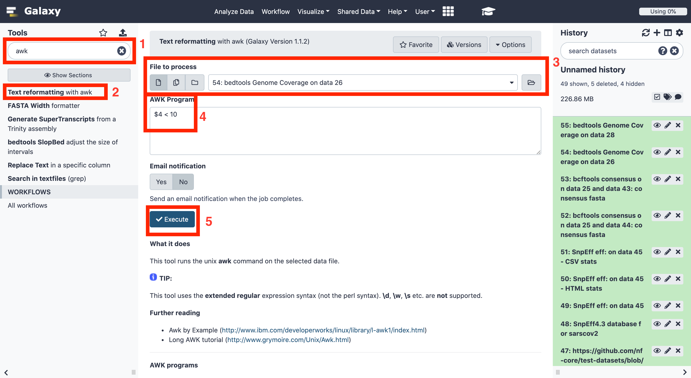

The resulting file is exactly the same as the one in Bedtools genomecoverage but only containing those lines with the genomic region coverage lower than 10X.

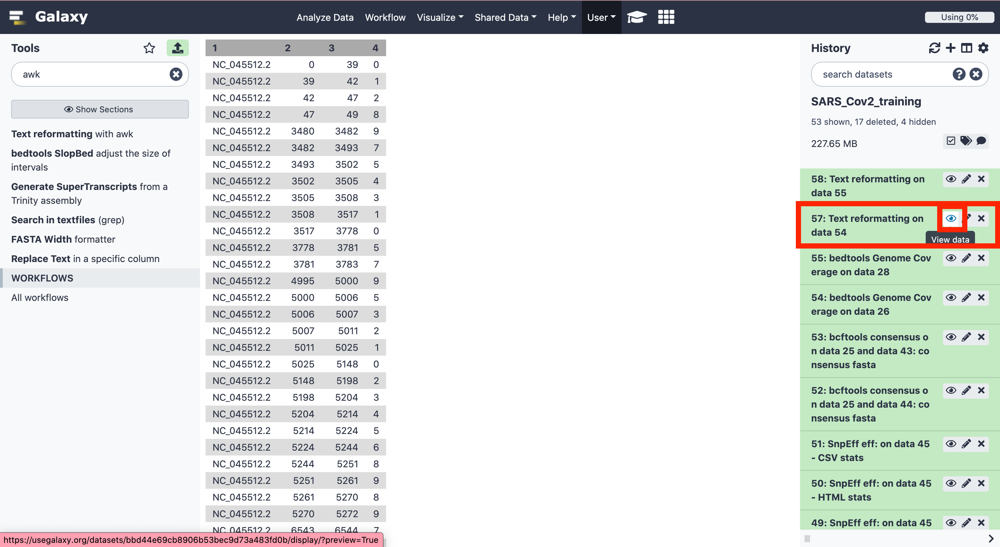

### Masking the consensus genome

Now that you have the consensus genome and the regions with a sequencing depth lower than 10X, you are going to "mask" those regions in the consensus genome replacing the nucleotides in those regions with "N"s. You have to search for "_bedtools maskfasta_", select "_bedtools MaskFastaBed use intervals to mask sequences from a FASTA file_" and then select the following parameters:

3. BED/bedGraph/GFF/VCF/EncodePeak file > Select the BED file resulting from AWK text filter.
4. FASTA file > Select the consensus genome fasta file generated with Bcftools consensus.
5. Execute

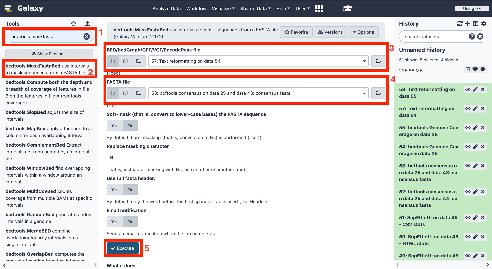

The resulting file is the consensus genome generated previously but now only contains Ns instead of A, T, G or C in the regions with less than 10X depth of coverage

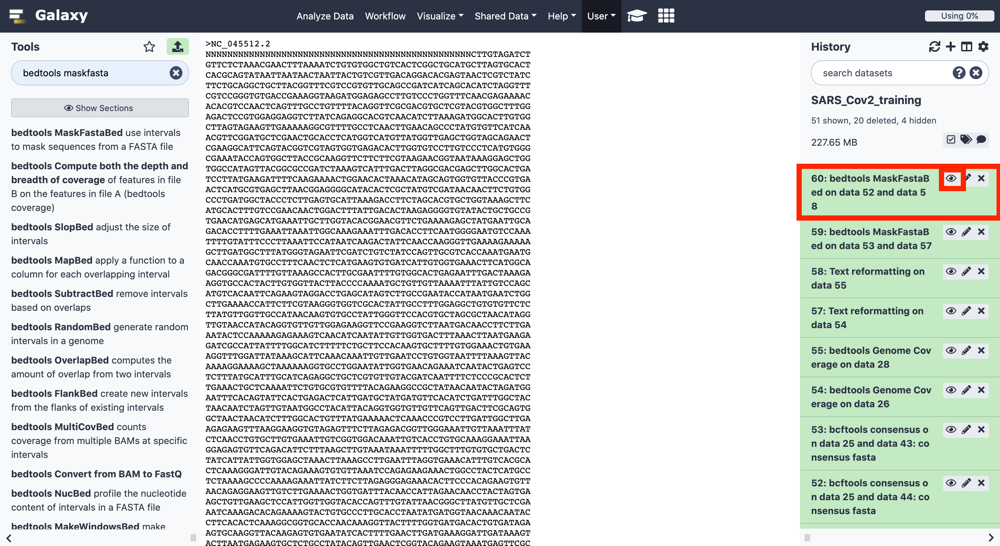

You can download this fasta file and use it to upload it to any public repository such as [ENA](https://www.ebi.ac.uk/ena/browser/) or [GiSaid](https://www.gisaid.org/). Also you can use it to perform phylogenetic trees or whatever else you want to do with the SARS-CoV-2 consensus fasta file.

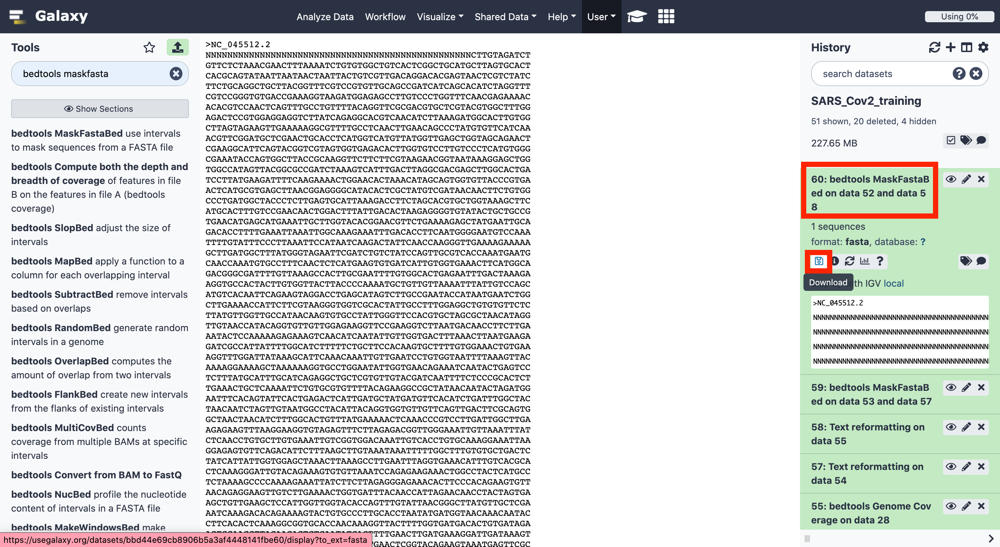

## Lineage
Now we are going to determine the lineage of the samples. We will use a software called pangolin. We are going to use the masked consensus genomes generated in the previous steps as follows:

1. Search for the **pangolin** tool
2. Select **Pangolin Phylogenetic Assignment of Outbreak Lineages** and set the following parameters:
3. Select the *bedtools MaskFasta* generated in the previous step as input fasta file.
4. Set maximum proportion of Ns allowed to 0.3. This will filter all the consensus with more than 30% of Ns.
5. **Execute**

<p align="center">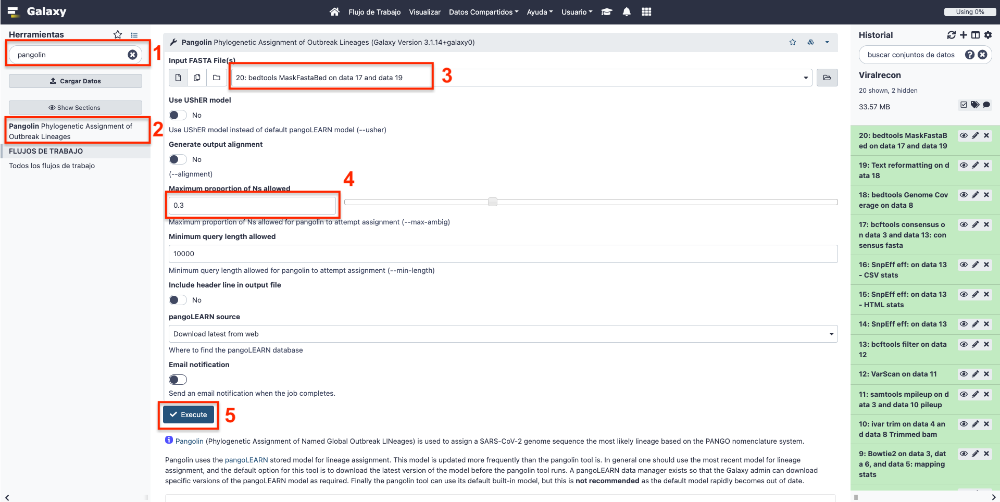</p>

Now we are going to have a look to the results from pangolin:

<p align="center">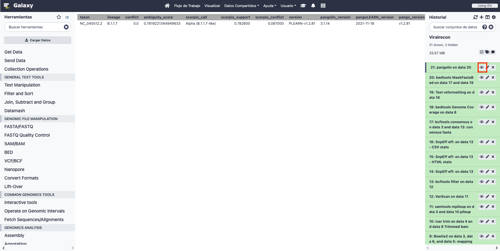</p>

As you can see

## All results

If you have any problem following this training and you want to visualize the resulting file you can access them through this URL:

https://usegalaxy.org/u/svarona/h/sarscov-2training
