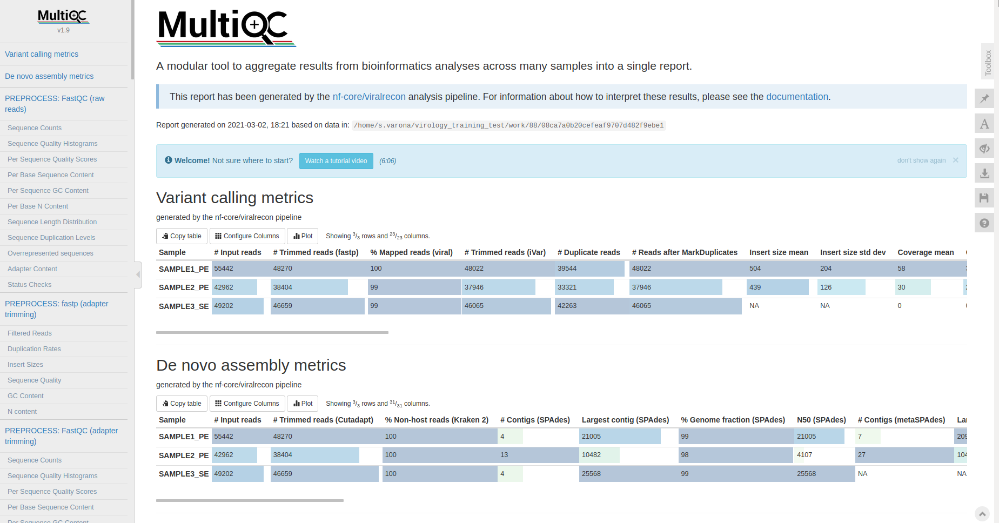
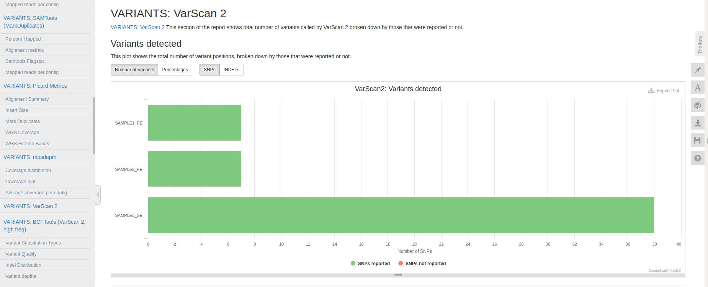
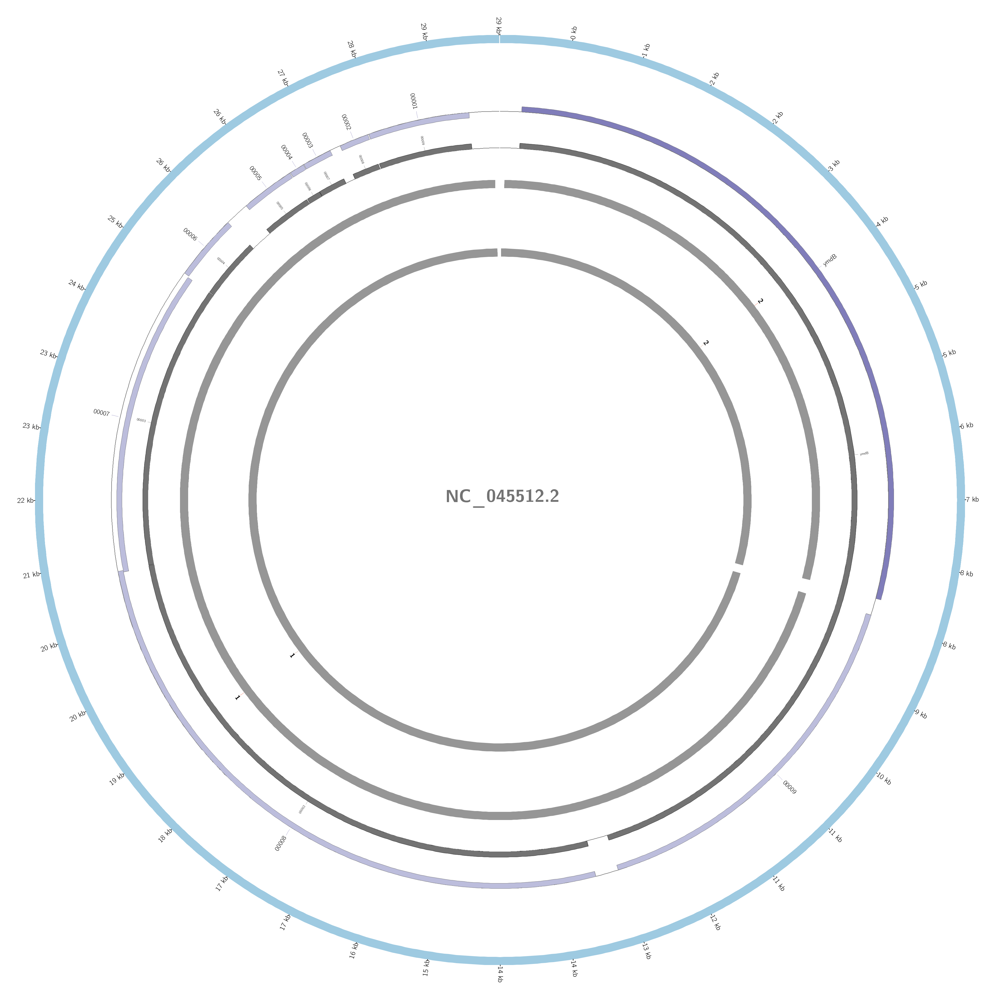

# SARS-CoV-2 training with Nextflow

In this report you will find all the information necessary to follow the steps to analyze SARS-CoV-2 data with Galaxy.

## Training overview
During this training we will following these steps:
* [Conda](#conda): Installation
* [Nextflow](#nextflow): Overview and installation
* [Viralrecon](#viralrecon): Overview and download
	* [Github](#github): Glance to main commands
* [Pipeline](#pipeline): Running the pipeline with command line and main results.
	* [Results](#results): Most important results.
* [Statistics](#statistics): Parse resulting files to obtain statistics.
* [Lineage](#Lineage): Lineage classification with Pangolin

## Conda
In case you haven't install conda yet, follow the instructions in [this link](https://docs.conda.io/en/latest/miniconda.html)

## Nextflow
[Nextflow](https://www.nextflow.io/) is a bioinformatics workflow manager that enables the development of portable and reproducible workflows. It supports deploying workflows on a variety of execution platforms including local, HPC schedulers, AWS Batch, Google Cloud Life Sciences, and Kubernetes. Additionally, it provides support for manage your workflow dependencies through built-in support for Conda, Docker, Singularity, and Modules.

### Installation
We will install Nextflow using conda running the following commands:

Create an environment
```
conda create --name nextflow
```

proceed ([y]/n)?
```
y
```

Activate the environment:
```
conda activate nextflow
```

Install nextflow in the environment through bioconda channel:
```
conda install -c bioconda nextflow
```

proceed ([y]/n)?
```
y
```

Test if it's correctly installed:
```
nextflow -v
```

## Viralrecon

[viralrecon](https://github.com/BU-ISCIII/viralrecon) is a bioinformatics analysis pipeline used to perform assembly and intra-host/low-frequency variant calling for viral samples. The pipeline supports short-read Illumina sequencing data from both shotgun (e.g. sequencing directly from clinical samples) and enrichment-based library preparation methods (e.g. amplicon-based: ARTIC SARS-CoV-2 enrichment protocol; or probe-capture-based).

The pipeline is built using Nextflow, a workflow tool to run tasks across multiple compute infrastructures in a very portable manner. It comes with Docker containers making installation trivial and results highly reproducible. Furthermore, automated continuous integration tests that run the pipeline on a full-sized data set using AWS cloud ensure that the code is stable.


### GitHub
To download and run viralrecon locally first you have to learn a little bit about github in command line (git). If you need more information about how to manage GitHub repositories, read our [Wiki documentation](https://github.com/BU-ISCIII/BU-ISCIII/wiki/Github--gitflow). You need to follow these steps:

In case you don't have git installed run:
```
sudo apt update
sudo apt install git libtbb2
```

Download the repo from github:
```
git clone https://github.com/BU-ISCIII/viralrecon.git
```

Moving inside the repo:
```
cd viralrecon
```

Moving to another branch:
```
git checkout dev
```

Leave repo's folder:
```
cd ..
```

Now you have your repo (viralrecon) installed and the program to run it (Nextflow), the next step is to run the pipeline.

## Pipeline
To run the pipeline you have to type in your terminal:

```
nextflow run viralrecon/main.nf -profile conda,test --skip-markduplicates --max_allele_freq 0.80 --assemblers metaspades --callers varscan2 -resume
```
With this command line you are going to run the default test data set with all the default parameters, unless the max_allele_freq which we are going to set to 0.80, which means that we will select only those variants with a minimum allele frequency of 80% to be included in the consensus. This data is a subset of amplicon based sequenced SARS-CoV2 samples. This means that during the pipeline the sequences/positions corresponding to the amplicon's primers are going to be removed.

This is the pipeline overview:
1. FastQC: Quality control
2. Fastp: Quality+size trimming
3. Mapping approach:
	1. bowtie2: Mapping to the reference genome
	2. ivar: Amplicon's adapter trimming by position
	3. VarScan2: Variant calling
	4. bcftools: Consensus generation
4. Assembly approach:
	1. cutadapt: Adapter trimming by sequence
	2. MetaSpades: De Novo assebmly
	3. ABACAS: Reference-based scaffold ordering

### Results
Now we are going to see the most important results of the pipeline. In case you were not able to run the pipeline, you can see the [results in this folder](../results/).

One of the most interesting results is the [MultiQC report](../results/multiqc/multiqc_report.html). In this report you have an overview of all the steps of the pipeline and their results.

The first results consist in a summary of both approaches performed by viralrecon (mapping and assembly). It gives different statistical measures such as *the number of input reads*, *the number of reads remaining after trimming*, *the percentage of mapped reads* and more.



You can interactively move across the report to see more results, such as the number of variants called by VarScan2 for each sample in a barplot.



Also, another interesting result is the one showed by [PlasmidID](https://github.com/BU-ISCIII/plasmidID) in [a circos plot](../results/assembly/metaspades/plasmidid/SAMPLE1_PE/images/SAMPLE1_PE_NC_045512.2.png). In the *de novo* asssembly approach, the resulting scaffolds assemblies are plotted against the reference SARS-CoV2 genome from Wuhan. In this case we can see that the whole reference genome is covered and represented by the contigs 1 and 2 from the assembly fasta.



## Statistics
Now we are going to parse the files generated by the pipeline to obtain a summary of the statistics. To have all the files ordered by sample we are going to create a file with the samples IDs.

```
ls results/variants/varscan2/*.vcf.gz | tr '/' '\t' | cut -f4 | tr '.' '\t' | cut -f1 | sort -u > samples_id.txt
```

First we are going to add the headers of the statistics table:

```
echo -e "host\tVirus_sequence\tsample\ttotal_reads\treads_hostR1\treads_host\t%reads_host\treads_virus\t%reads_virus\tunmapped_reads\t%unmaped_reads\tmean_DP_coverage_virus\tCoverage>10x(%)\tVariants_in_consensusx10\tMissense_Variants\t%Ns10x" > summary_table.tab
```
This statistics includes:
1. Host species: Because the samples can have different host, Human, Mink, Bat.
2. Virus_sequence: The reference viral sequence, because the pipeline can be run for different viral genomes.
3. sample: The sample name.
4. total_reads: The number of total reads after trimming.
5. reads_hostR1: The number of reads mapped to the Host genome from Kraken2 output. It only retrieves the number of reads mapped to R1, this means, the half of the real reads mapped to the host genome for pair-end data.
6. reads_host: For pair-end data, the double of the previous column.
7. %reads_host: Percentage of trimmed reads mapped to the host genome.
8. reads_virus: Number of reads mapped to the virus reference genome.
9. %reads_virus: Percentage of trimmed reads mapped to the reference viral genome.
10. unmapped_reads: Number of reads that didn't mapped to neither host or virus genomes.
11. %unmaped_reads: Percentage of trimmed reads that didn't map to neither host or viral genome.
12. mean_DP_coverage_virus: Mean depth of coverage of the reference viral genome.
13. Coverage>10x(%): Percentage of coverage of the reference genome with more than 10X coverage.
14. Variants_in_consensusx10: Number of variants with more than 80% allele frequency that were included in the consensus genome.
15. Missense_Variants: Number of variants included in the consensus that are missense variants.
16. %Ns10x: Percentage of Ns included in the consensus, which means % of nucleotides that had a coverage lower than 10X.

We are going to create the content of the first two columns, because we know that this is data coming from SARS-Cov2 reference genome (with NSCBI accession ID: NC_045512.2) obtained from human samples.

```
metadata_content=$(cat ./samples_id.txt | xargs -I % echo -e "Human\tNC_045512.2")
```

Now we are going to get the number of total reads after trimming. These can be obtained from the flagstats file generated by samtools with stats about the mapping process from the bam files. You can have a look at one of those files first:

### Samtools mapping stats

```
cat results/variants/bam/samtools_stats/SAMPLE1_PE.sorted.bam.flagstat
```
You can see that the first line is the number of total reads that passed to the bowtie2 mapping process, those that passed the trimming process. You can also see the number and percentage of reads mapped to the reference genome.
To obtain the number of total reads after trimming for all the samples, run:
```
cat samples_id.txt | while read in; do cat results/variants/bam/samtools_stats/${in}.sorted.bam.flagstat | grep '+ 0 in total' | tr ' ' '\t' | cut -f1; done
```

For the next steps we will store this information in a variable
```
total_reads=$(cat samples_id.txt | while read in; do cat results/variants/bam/samtools_stats/${in}.sorted.bam.flagstat | grep '+ 0 in total' | tr ' ' '\t' | cut -f1; done)
```

From these files we can also obtain the number and percentage of reads mapped to the reference viral genome. For the numner of mapped reads:
```
cat samples_id.txt | while read in; do cat results/variants/bam/samtools_stats/${in}.sorted.bam.flagstat | grep '+ 0 mapped' | tr ' ' '\t' | cut -f1; done
```
For the percentage:
```
cat samples_id.txt | while read in; do cat results/variants/bam/samtools_stats/${in}.sorted.bam.flagstat | grep '+ 0 mapped' | tr '(' '\t' | cut -f2 | tr '%' '\t' | cut -f1; done
```

An then store them in variables:
```
mapped_reads=$(cat samples_id.txt | while read in; do cat results/variants/bam/samtools_stats/${in}.sorted.bam.flagstat | grep '+ 0 mapped' | tr ' ' '\t' | cut -f1; done)
percentage_mapped_reads=$(cat samples_id.txt | while read in; do cat results/variants/bam/samtools_stats/${in}.sorted.bam.flagstat | grep '+ 0 mapped' | tr '(' '\t' | cut -f2 | tr '%' '\t' | cut -f1; done)
```

### Host statistics with kraken2

Now we are going to obtain the number of host reads. These results are in the `results/assembly/kraken2` folder. To see one of these reports, run:
```
cat results/assembly/kraken2/SAMPLE1_PE.kraken2.report.txt
```
As we are running the pipeline with a test dataset so it can be ruin quickly, the Kraken2 database fro the host genome, it's not the human genome (it' should IRL analysis), in this case it's just a bacteria because it is small enough. The interesting part of these file is the last line and the third column, so we wills store this value in a variable:

```
host_R1=$(cat samples_id.txt | while read in; do cat results/assembly/kraken2/${in}.kraken2.report.txt | tail -n1 | cut -f3; done)
```
And then we will multiply this value by 2 to obtain the total number of reads:
```
host_R2=$(cat samples_id.txt | while read in; do cat results/assembly/kraken2/${in}.kraken2.report.txt | tail -n1 | cut -f3; done | awk '{print $1*2}')
```
And for the percentage we will take the first column of the last line:
```
percentage_read_host=$(cat samples_id.txt | while read in; do cat results/assembly/kraken2/${in}.kraken2.report.txt | tail -n1 | cut -f1; done)
```

### Unmapped reads

To obtain the number of unmapped reads we will do: total_reads - (reads_host + reads_virus):
```
unmapped_reads=$(paste <(echo "$total_reads") <(echo "$host_R2") <(echo "$mapped_reads") | awk '{print $1-($2+$3)}')
```
And for the percentage: unmapped_reads*100/total_reads
```
percentage_unmapped_reads=$(paste <(echo "$total_reads") <(echo "$unmapped_reads") | awk '{print $2*100/$1}')
```

This value of unmapped reads is interesting because a lot of reads that do not match with neither host or virus can indicate a contamination of the samples with another bacteria or virus.

### Mapping stats with Picard
To obtain the mean depth of coverage of the viral genome we are going to see the statistics generated by Picard about the mapping process. We can see one of those files:

:warning: never do `cat` to any of these files, they are too long.

```
less results/variants/bam/picard_metrics/SAMPLE1_PE.trim.mkD.CollectWgsMetrics.coverage_metrics
```

You can see in the first 10 lines a variety of stats about the mapping between the sample and the viral reference genome, such as the mean depth of coverage or the percentage of genome covered with at least %X, 10X, 15X, 20X... And so on.

So to obtain the mean depth of coverage, from the 8th line, we will keep the second column.
```
mean_dp=$(cat samples_id.txt | while read in; do head -n8 results/variants/bam/picard_metrics/${in}.trim.mkD.CollectWgsMetrics.coverage_metrics | tail -n1 | cut -f2; done)
```
And for the percentage of reference genome covered at least with a depth of 10X:
```
percentage_10x=$(cat samples_id.txt | while read in; do head -n8 results/variants/bam/picard_metrics/${in}.trim.mkD.CollectWgsMetrics.coverage_metrics | tail -n1 | cut -f16; done)
```

### Variants
Now we are going to have a look to the variant calling results. They are stored in the `results/variants/varscan2/`. The files that have a "AF0.8" are the ones filtered by allele frequency and therefore the variants included in the consensus genome. Let's have a look to the VCF files:

```
zcat results/variants/varscan2/SAMPLE1_PE.AF0.8.vcf.gz | grep -v '^#'
```
The .VCF file's columns are:
1. The reference genome chromosome, only one in this case.
2. The position of the variant.
3. Variant ID (usually it's always a dot)
4. The reference allele
5. The variant allele
6. Variant quality (usually it's always a dot)
7. If the variant passed the filters (PASSED)
8. Some information about the variant depth, the times wild type allele was called, if it's heterozygous or homozygous...
9. The acronyms of the information in the next column.
10. The values of the previously indicated values:
	- Genotype
	- Genotype Quality
	- Raw Read Depth (>10)
	- Quality Read Depth of bases with Phred score >= 20 (>10)
	- Depth of reference-supporting bases
	- Depth of variant-supporting bases
	- Variant allele frequency (>80%)
	- P-value from Fisher's Exact Test
	- Average quality of reference-supporting bases
	- Average quality of variant-supporting bases
	- Depth of reference-supporting bases on forward strand
	- Depth of reference-supporting bases on reverse strand
	- Depth of variant-supporting bases on forward strand
	- Depth of variant-supporting bases on reverse strand

So, to count the number of variants for the table it is as easy as counting the number of lines in the file:

```
number_variants=$(cat samples_id.txt | while read in; do zcat results/variants/varscan2/${in}.AF0.8.vcf.gz | grep -v '^#' | wc -l; done)
```

From the total number of variants, to obtain the number of variants that are missense we will have to see the annotation files from SnpEff in `results/variants/varscan2/snpeff/`. To see one file:
```
cat SAMPLE1_PE.AF0.8.snpSift.table.txt
```

As you can see the first columns are very similar to the ones from VarScan2, but in this case we have more information about the gene were the variant is located and some information about its effect. To count the number of missense variants we will:
```
missense_variant=$(cat samples_id.txt | while read in; do grep 'missense_variant' results/variants/varscan2/snpeff/${in}.AF0.8.snpSift.table.txt | wc -l; done)
```

### Percentage masking
Finally, we will count the number of Ns in the consensus genome. This is, the number of nucleotides that were masked due to low coverage. We will have to run [this python script](./percentageNs.py) for which you need to install Biopython and SeqIO in case you haven't yet:

```
pip install biopython
```
Then create the script or copy them from [here](./percentageNs.py)

```
nano percentageNs.py
```
And paste:
```
from Bio import SeqIO
import os
import argparse

parser = argparse.ArgumentParser(description='Count %Ns')
parser.add_argument('input_dir', type=str, help='Input dir masked files')
parser.add_argument('output_file', type=str, help='Output file for Ns count')
args = parser.parse_args()

out_handle = open(args.output_file,"w")

for f in os.listdir(args.input_dir):
    if f.endswith('.masked.fa'):
        ffpath=os.path.join(args.input_dir,f)
        for record in SeqIO.parse(ffpath, "fasta"):
            n_count = record.seq.count("N") + record.seq.count("n")
            out_handle.write("%s\t%0.2f\n" % (record.id, n_count*100.0/len(record)))

out_handle.close()
```

Then run:
```
python ./percentageNs.py results/variants/varscan2/consensus/ %Ns.tab
```

In the file %Ns.tab you will see a file with two columns: One with the sample name and other one with the percentage of Ns for each sample.

```
cat %Ns.tab
```

Now we will include these values in our table like this:
```
percentage_ns=$(cat samples_id.txt | while read in; do grep ${in} %Ns.tab | cut -f2 ; done)
```

### Create the table
Now we are going to paste all the columns in variables generated above and put them at the end of the file with the header.
```
paste <(echo -e "$metadata_content\n") <(cat samples_id.txt) <(echo -e "$total_reads\n") <(echo -e "$host_R1\n") <(echo -e "$host_R2\n") <(echo -e "$percentage_read_host\n") <(echo -e "$mapped_reads\n") <(echo -e "$percentage_mapped_reads\n") <(echo -e "$unmapped_reads") <(echo -e "$percentage_unmapped_reads") <(echo -e "$mean_dp") <(echo -e "$percentage_10x") <(echo -e "$number_variants") <(echo -e "$missense_variant") <(echo -e "$percentage_ns") --delimiters '\t' >> summary_table.tab
```

Or, all together, without variables:

```
paste <(echo -e "$(cat ./samples_id.txt | xargs -I % echo -e "Human\tNC_045512.2")\n") <(cat samples_id.txt) <(echo -e "$(cat samples_id.txt | while read in; do cat results/variants/bam/samtools_stats/${in}.sorted.bam.flagstat | grep '+ 0 in total' | tr ' ' '\t' | cut -f1; done)") <(echo -e "$(cat samples_id.txt | while read in; do cat results/assembly/kraken2/${in}.kraken2.report.txt | tail -n1 | cut -f3; done)") <(echo -e "$(cat samples_id.txt | while read in; do cat results/assembly/kraken2/${in}.kraken2.report.txt | tail -n1 | cut -f3; done | awk '{print $1*2}')") <(echo -e "$(cat samples_id.txt | while read in; do cat results/assembly/kraken2/${in}.kraken2.report.txt | tail -n1 | cut -f1; done)") <(echo "$(cat samples_id.txt | while read in; do cat results/variants/bam/samtools_stats/${in}.sorted.bam.flagstat | grep '+ 0 mapped' | tr ' ' '\t' | cut -f1; done)") <(echo "$(cat samples_id.txt | while read in; do cat results/variants/bam/samtools_stats/${in}.sorted.bam.flagstat | grep '+ 0 mapped' | tr '(' '\t' | cut -f2 | tr '%' '\t' | cut -f1; done)") <(echo -e "$(paste <(echo "$(cat samples_id.txt | while read in; do cat results/variants/bam/samtools_stats/${in}.sorted.bam.flagstat | grep '+ 0 in total' | tr ' ' '\t' | cut -f1; done)") <(echo "$(cat samples_id.txt | while read in; do cat results/assembly/kraken2/${in}.kraken2.report.txt | tail -n1 | cut -f3; done | awk '{print $1*2}')") <(echo "$(cat samples_id.txt | while read in; do cat results/variants/bam/samtools_stats/${in}.sorted.bam.flagstat | grep '+ 0 mapped' | tr ' ' '\t' | cut -f1; done)") | awk '{print $1-($2+$3)}')") <(echo -e "$(paste <(echo "$(cat samples_id.txt | while read in; do cat results/variants/bam/samtools_stats/${in}.sorted.bam.flagstat | grep '+ 0 in total' | tr ' ' '\t' | cut -f1; done)") <(echo "$(paste <(echo "$(cat samples_id.txt | while read in; do cat results/variants/bam/samtools_stats/${in}.sorted.bam.flagstat | grep '+ 0 in total' | tr ' ' '\t' | cut -f1; done)") <(echo "$(cat samples_id.txt | while read in; do cat results/assembly/kraken2/${in}.kraken2.report.txt | tail -n1 | cut -f3; done | awk '{print $1*2}')") <(echo "$(cat samples_id.txt | while read in; do cat results/variants/bam/samtools_stats/${in}.sorted.bam.flagstat | grep '+ 0 mapped' | tr ' ' '\t' | cut -f1; done)") | awk '{print $1-($2+$3)}')") | awk '{print $2*100/$1}')") <(echo -e "$(cat samples_id.txt | while read in; do head -n8 results/variants/bam/picard_metrics/${in}.trim.mkD.CollectWgsMetrics.coverage_metrics | tail -n1 | cut -f2; done)") <(echo -e "$(cat samples_id.txt | while read in; do head -n8 results/variants/bam/picard_metrics/${in}.trim.mkD.CollectWgsMetrics.coverage_metrics | tail -n1 | cut -f16; done)") <(echo -e "$(cat samples_id.txt | while read in; do zcat results/variants/varscan2/${in}.AF0.8.vcf.gz | grep -v '^#' | wc -l; done)") <(echo -e "$(cat samples_id.txt | while read in; do grep 'missense_variant' results/variants/varscan2/snpeff/${in}.AF0.8.snpSift.table.txt | wc -l; done)") <(echo -e "$(cat samples_id.txt | while read in; do grep ${in} %Ns.tab | cut -f2 ; done)") --delimiters '\t' >> summary_table.tab
```

## Lineage
Now that we know which samples have less than 50% of Ns, we can use those consensus genomes to determine the lineage of the genomes. For this we will use a program called [Pangolin](https://github.com/cov-lineages/pangolin). We will create a new conda environment for this.
```
conda deactivate
git clone https://github.com/cov-lineages/pangolin.git
cd pangolin
conda env create -f environment.yml
conda activate pangolin
python setup.py install
cd ..
```

Now we need to concatenate de consensus files in a single fasta file like this:
```
cat results/variants/varscan2/consensus/*.AF0.8.consensus.masked.fa >> consensus_masked.fasta
```

And now we can run pangolin:
```
pangolin consensus_masked.fasta
```

This process will create a file called [`lineage_report.csv`](../results/lineage_report.csv) with the lineage classification of each sample.
