# SARS-CoV-2 training with galaxy

In this report you will find all the information necessary to follow the steps to analyze SARS-CoV-2 data with Galaxy.

## Training overview
During this training we will following these steps:
* [Register/Login](#register/login): Register or login into Galaxy website.
* [Data](#data): Upload data for the analysis.
* [Quality](#quality): Analysis of the quality of the raw reads.
* [Trimming](#trimming): Quality trimming using fastp
* [Mapping](#mapping): Mapping reads to reference genome with Bowtie2
* [Stats](#stats): Mapping statistics with samtools and picard.

## Register/Login

First of all, you have to create a user (or login into your user if you already have one) in the [Galaxy website](https://usegalaxy.org/) by clicking in the button indicated in the image:

You can do this analysis without creating a user, but your history will be saved into your user so you can access later at home.

Once you are registered we can start with the analysis workflow.

## Data

Before starting with any analysis we have to upload de data we want to analyze into galaxy. The are three different ways to upload data to Galaxy, from which we will explain you some of them along this training.

### Uploading data from your local files
In order to do upload files from our local machine to Galaxy, we have to click on the button shown in the image (_Download from URL or upload files from disk_)

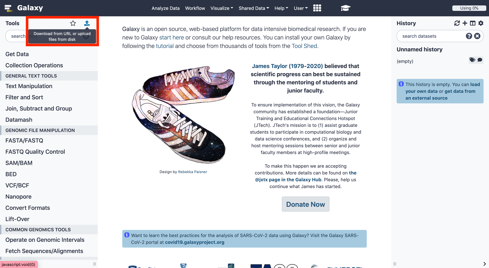

Then, in the "_Regular_" tab we have to choose "_Choose local files_" and select the files we want to upload, both R1 and R2 at the same time.

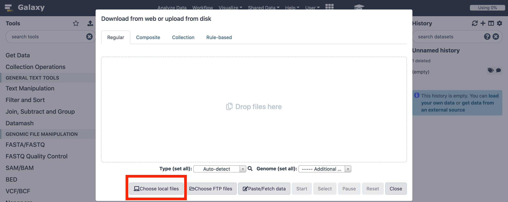

Once selected we just have to click in start button and files will start lo upload (this will take a while).

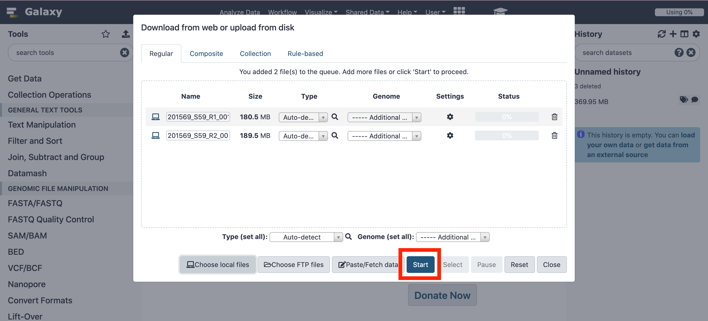

Once files are uploaded we can close the window clicking on "_close_" button. Both files will appear in the right panel.

## Quality

### Quality Analysis (FastQC)
Once we have the raw data, an important step is to analyze the quality of the reads, to know if the reads are worth it. To do this, we have to look for the program "_FastQC_" in the search bar, then select the program in the list and a new panel for FastQC will appear.

In the panel we will have to select the fastq files R1 and R2 for both samples. To do this, in the "_Short read data from your current history_" header, we will click on "_Multiple datasets_"

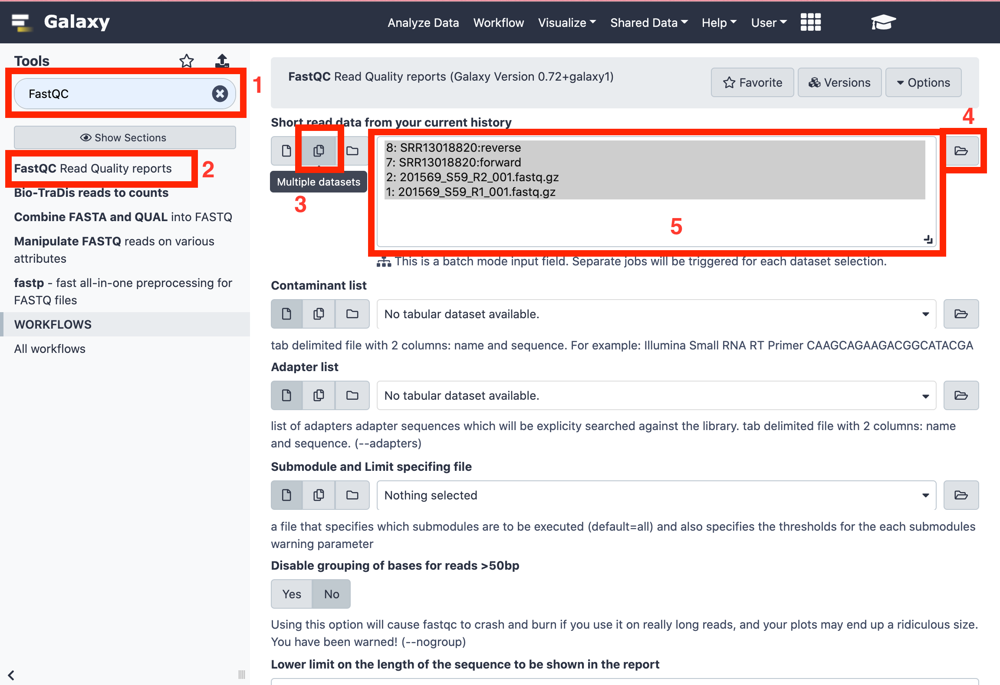

and then in the new window select from our jobs the ones of the samples we want:

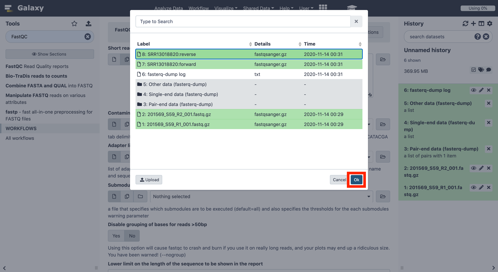

**This is for the case that you used two samples instead of one like in this training"***

This program will generate a message like this one, were we can read that, each .fastq file is going to generate two different jobs, one for the Raw Data and another one for the .HTML report.

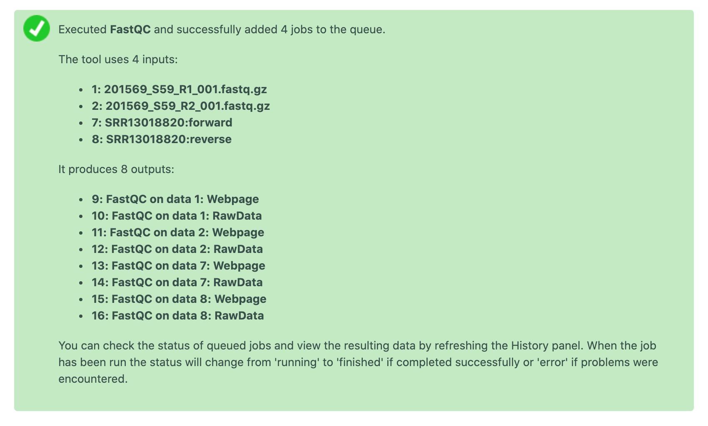

### FastQC results visualization
To visualize the information coming from FastQC we just have to select the job of interest. In this case we are interested in the "_Web page results_" so for the sample we want to see the results we have to click in the _eye_ to visualize galaxy results:

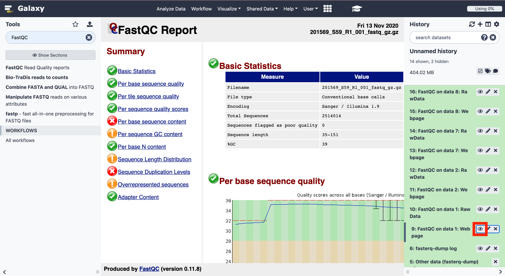

This report gives different type of information about the sequencing quality of the reads. Clicking in the arrows in the bottom right/left corners of the page we can hide/show the side panels.

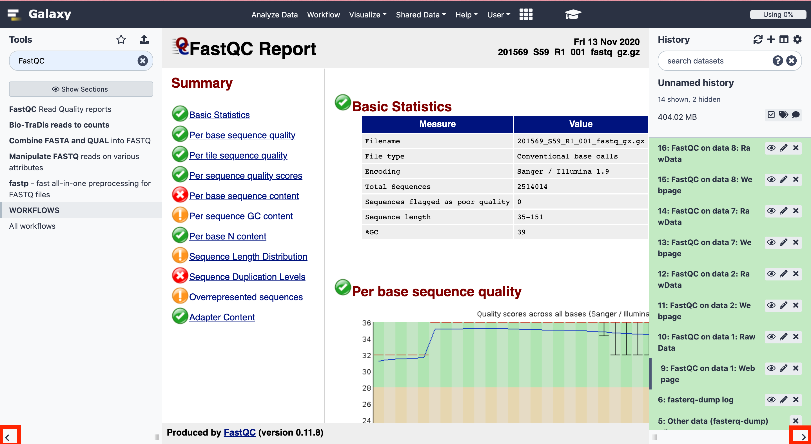

So the central panel with the results we want to visualize will bee better seen.

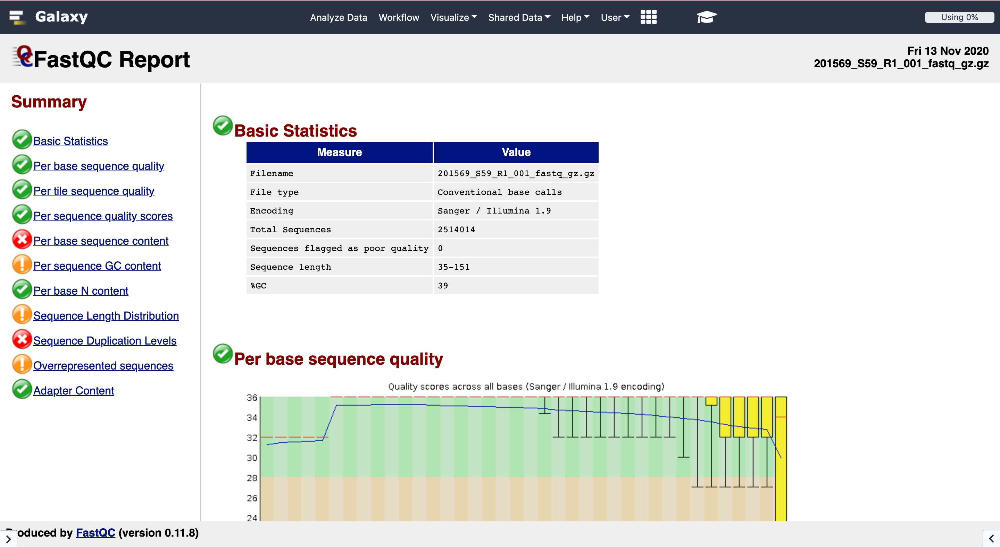

**_For more information about FastQC output visit [FastQC website](https://www.bioinformatics.babraham.ac.uk/projects/fastqc/Help/3%20Analysis%20Modules/)_**

## Trimming

### Quality trimming (Fastp)
Once we have check the quality of our reads, it's important to trim low quality nucleotides from those reads, for which we will use _Fastp_. So, in the search bar you look for fastp and then select "_fastp - fast all-in-one preprocessing for FASTQ files_". There, we will have to change some parameters ensure the trimming accuracy for this amplicon data. First of all we are going to do the analysis for the sample we gave to you (201569). These are the field we will have to change:

3. Single-end or paired reads > Paired
4. Input 1 > Browse datasets (right folder icon) > Select 201569_S59_R1_001.fastq.gz
    Input 2 > Browse datasets > Select 201569_S59_R2_001.fastq.gz
6. Display Filter Options
  6. Quality Filtering options
    7. Qualified Quality Phred = 30
    8. Unqualified percent limit = 10
  9. Length Filtering Options
    10. Length required = 50
11. Read modification options
  12. PoliX tail trimming > Enable polyX tail trimming
  13. Per read cutting by quality options
    14. Cut by quality in front (5') > Yes
    15. Cut by quality in tail (3') > Yes
    16. Cutting mean quality = 30
17. Output options
  18. Output HTML report > Yes
  19. Output JSON report > Yes

Finally, click on "_Execute_"

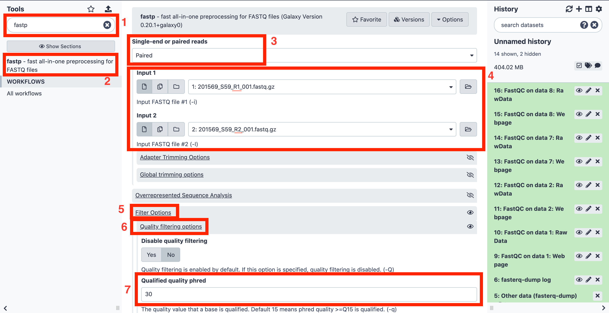
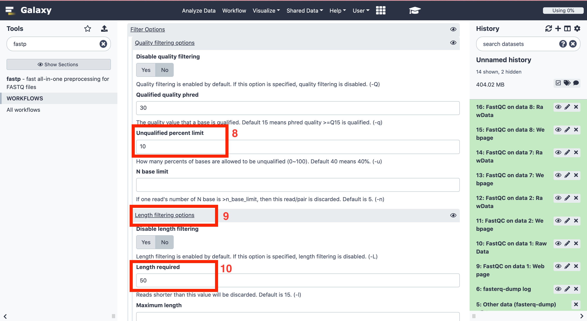
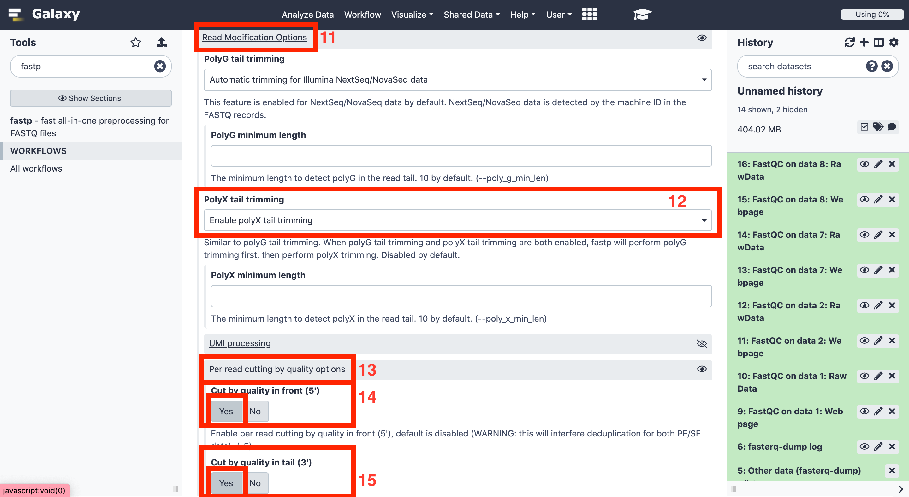
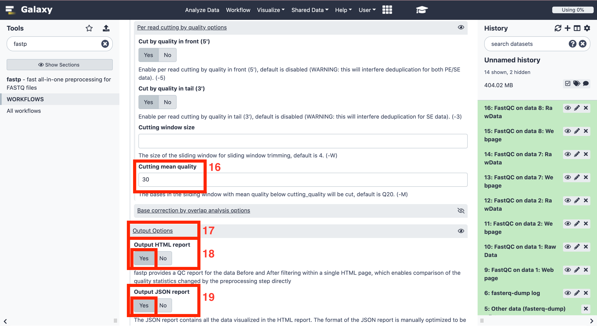

A message like this one will appear, which means that 4 results will be generated:
  1. One with the R1 trimmed reads
  2. Another one with the R2 trimmed reads
  3. Another one with the HTML results
  4. A last one with the JSON results

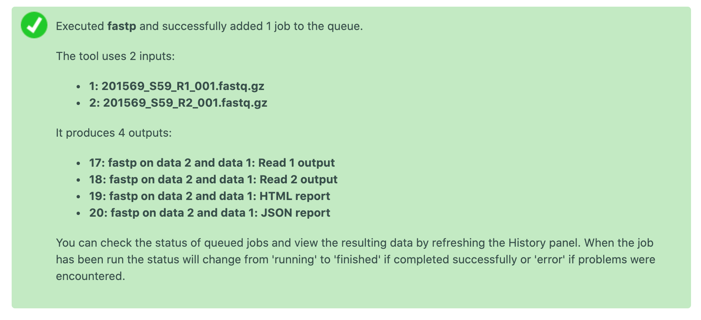

### Fastp results

Once fastp analysis is done, you can see the results by clicking in the eye ("_View Data_") in the fatp HTML results. We will see a report like this one:

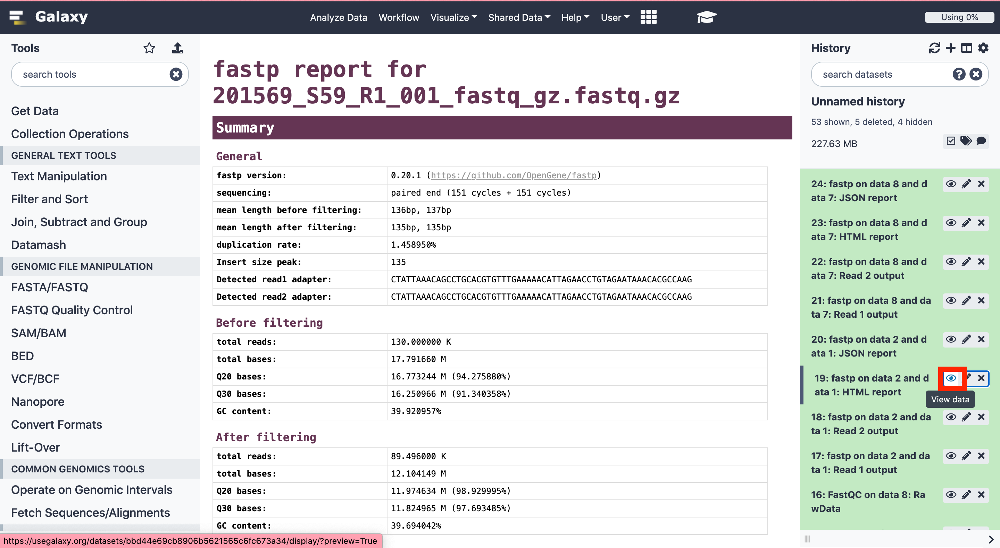

This report can be downloaded by clicking in the results name ("_fastp on data 2 and data 1: HTML report_") and then in "_Download_".

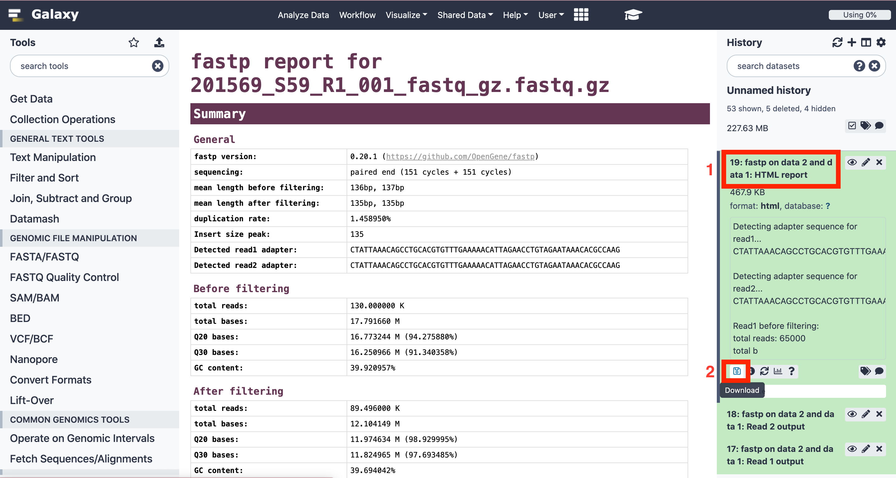

This will download a .zip folder that contains the .html report, that can be visualize in your computer using any browser (such as Google Chrome) and interactively scroll around the results.

Among the most relevant results, you have the:

- Summary: Stats summary
  - After filtering: Statistics of the reads after quality filtering
    - reads passed filters: Reads remaining after quality filter trimming
    - reads with low quality: Reads that were remove due to low quality
    - reads too short: Reads that didn't pass the minimum length filter.
  - After filtering: Plots after filtering
    - After filtering: read1: quality: Plot with the evolution of R1 quality over read position. Usually it decays in the last nucleotides.
    - After filtering: read2: quality: Same plot for R2.

**_For more information about FastQC output visit [Fastp github](https://github.com/OpenGene/fastp)_**

## Mapping

In order to call for variants between the samples and the reference, it's mandatory to map the sample reads to the reference genome. To do this we need the fasta file of the reference and the Bowtie2 index of that fasta file.

### Reference genome for mapping

Prior to any analysis, we have to download the fasta reference genome, and we are going to do it in a new way we didn't see in the previous steps, using the following URL:

_https://github.com/nf-core/test-datasets/raw/viralrecon/genome/NC_045512.2/GCF_009858895.2_ASM985889v3_genomic.200409.fna.gz_

So you have to copy the URL direction, and do then select "_Download from web or upload from disk_", the select "_Paste/Fetch data_" and in the new window that appears you should paste the URL above and finally select "_Start_". Now the fasta file of the reference is download.

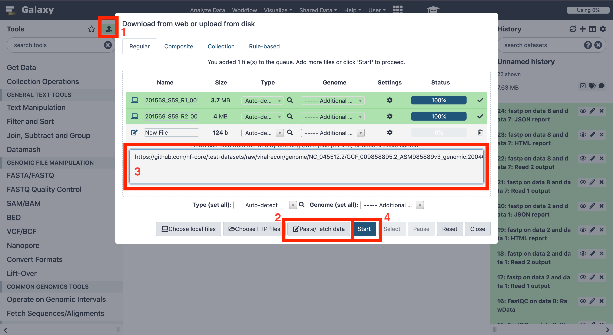

### Mapping reads with reference genome (Bowtie2)

Now we can start with the main mapping process. The first thing we have to do is look for the program "_Bowtie2_" in the search bar and then select "_Bowtie2 - map reads against reference genome_". Here we will have to set the following parameters, for the first sample:

3. Is this single or paired library > Paired-end
4. Fasta/Q file #1: **fastp on data 2 and data 1: Read 1 output**
5. asta/Q file #2: **fastp on data 2 and data 1: Read 2 output**
6. Will you select a reference genome from your history or use a built-in index? > Use a genome from the history and create index
  - **This is very important because we haven't previously created the SARS-Cov2 genome index, si bowtie 2 will generate it automatically.**
7. Select reference genome > https://github.com/nf-core/test-datasets/raw/viralrecon/genome /NC_045512.2/GCF_009858895.2_ASM985889v3_genomic.200409.fna.gz
  - It's important to select the file we downloaded from URL.
8. Do you want to use presets? > Very sensitive local
9. Save the bowtie2 mapping statistics to the history > Yes
10. Execute

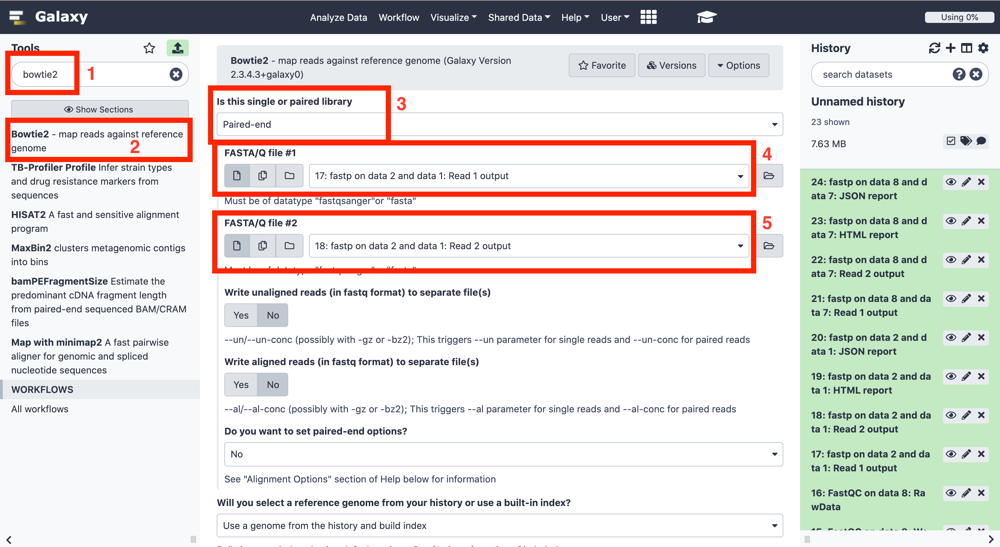
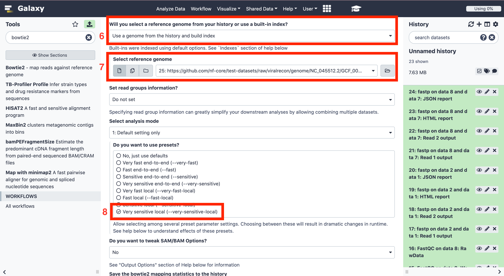

We will see a message like this one:

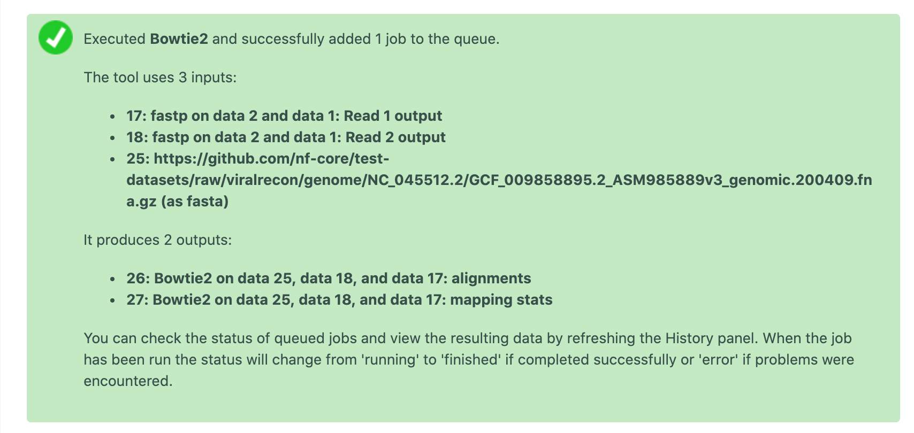

### Mapping results:

Now we can see the mapping results for the samples. The bowtie2 resulting file is a .bam file, which is not easy to read by humans. This .bam file can be downloaded by clicking in the alignment file and then into download. Then, the resulting .gz file will contain the alignment .bam file that can be introduced in a software such as [IGV](http://software.broadinstitute.org/software/igv/) with the reference genome fasta file.

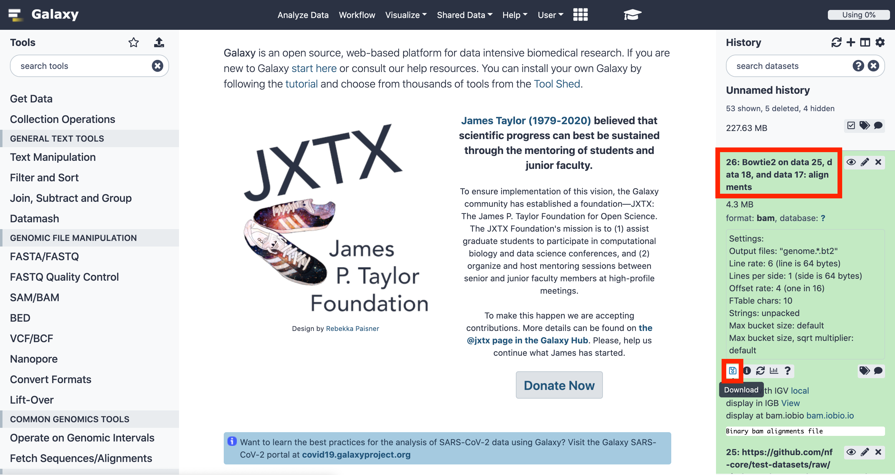

In our case, the file that can be visualize is the statistics file, which contains information such as the percentage of reads that aligned.

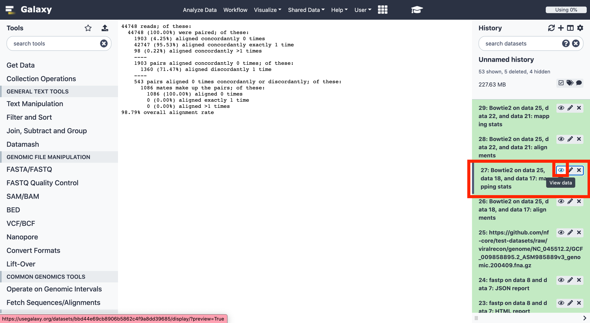

## Stats

### Samtools flagstat

### Picard CollectWgsMetrics

## Amplicons

After mapping

### Download amplicon data

https://raw.githubusercontent.com/nf-core/test-datasets/viralrecon/genome/NC_045512.2/amplicon/nCoV-2019.artic.V3.primer.fasta

### Trim amplicon sequences

## VarScan

FORMAT/AD / (FORMAT/AD + FORMAT/RD) >= 0.75

## SnpEff

https://github.com/nf-core/test-datasets/blob/viralrecon/genome/NC_045512.2/GCF_009858895.2_ASM985889v3_genomic.200409.gff.gz?raw=true

History: https://usegalaxy.org/u/svarona/h/unnamed-history
