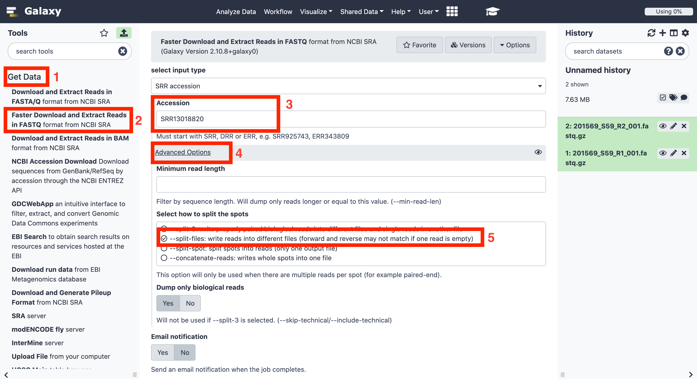
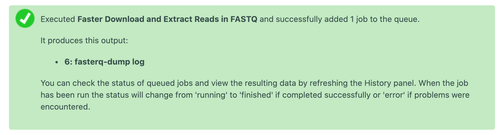

# Home work

Once you've learn how to analyze SARS-CoV-2 data from your local computer, we want you to try to analyze SARS-CoV-2 data from SRA. For that, we will explain you another way to upload data to your galaxy history, using data coming from SRA:

## Upload data from SRA/SRR ID
Another way to upload data to galaxy is to give a SRR/SRA ID. To do this, first of all you have to select "_Get Data_", then more options will be displayed, among which we have to choose "_Faster Download and Extract Reads in FASTQ format from NCBI SRA_". In the central panel, new options will appear, where we have to introduce de SRR ID "_SRR13018820_" in "_Accession_", then we have to select "_Advanced options_" and choose "_--split-files_" to write reads into different files. Finally click on "_Execute_" button to start downloading data.

A message like this one should appear if everything went properly:

