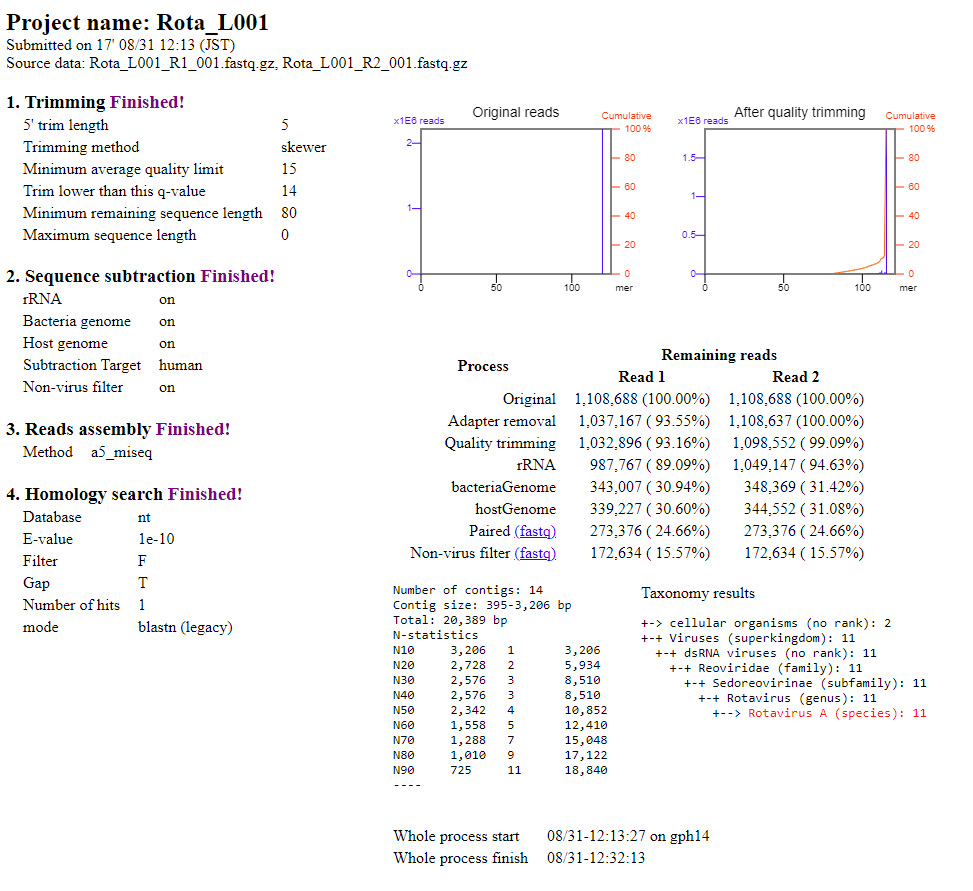
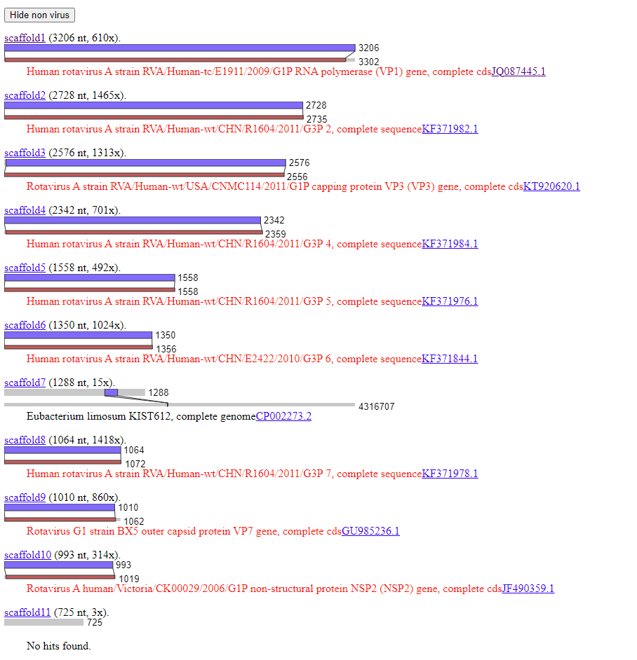
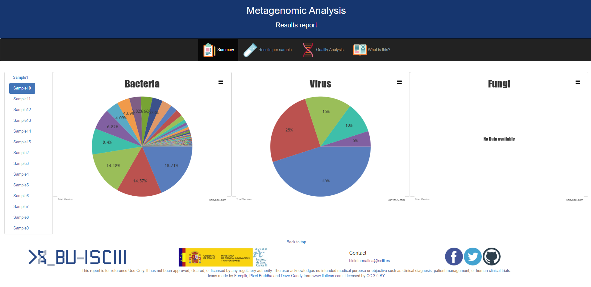
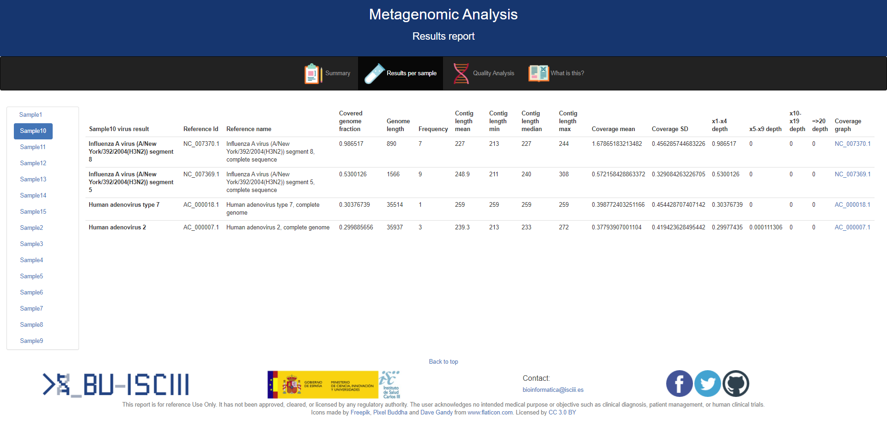

# Metagenomics training

In this report you will find all the information necessary to follow the steps to run a basic metagenomics analysis.

## Training overview
During this training we will following these steps:
* [Mapping](#mapping): Introduction to mapping.
* [Assembly](#assembly): Introduction to assembly.
* [Register/Login](#register/login): Register or login into VirusTAP and Galaxy.
* [Data](#data): Upload data for the analysis.
* [Parameters/Steps](#parameters/steps): Select the desired parameters and steps for the pipeline.
* [Run/Results](#run/results): Execute and explore the results.
* [Kraken](#kraken): K-mer mapping approach using Galaxy.
* [Combined approach](#combinedapproach): Both mapping and assambly can be combined to better understand your sample.

## Mapping

Mapping is a type of alignment that consist in placing a sequence inside a larger sequence. For example, it is used to determine the position of a read or contig in a reference genome.

This approach is useful when you have a reference genome for the same species of the organisms you are working with, it is faster than a *de-novo* assambly, and also allows variant discovery.

## Assembly

Assembling consist in reconstructing a representation of the original sequenced genome from shorter fragments generated by the sequencer machine called reads. It does not need a reference genome, and it is very uncommon the whole genome is reconstructed; they usually return only contigs that have to be elongated into scaffolds. Between those contigs there will be gaps, portions of the genome that could not be rebuilt.

This approach takes longer to compute, but it can discover new genomes.

## Register/login

In order to access VirusTAP, you first will need to log in or create a new academic account at [VirusTAP](https://gph.niid.go.jp/virustap/system_in):

## Data

We will start by giving a name to our analysis and uploading the raw data. In our case, we are going to use the files `Rota_L001_R1_001.fastq.gz` and `Rota_L001_R2_001.fastq.gz`. For this server, the data has to be compressed in this specific format.

The data can be downloaded [here](https://we.tl/t-jMLNdSmn2K).

## Parameters/Steps

The next step is to select the right paremeters for our analysis in each step of the pipeline we are going to run.

As you can see, the pipeline contains the following steps:

- **Quality trimming and adapter removal**: The first step is the quality control. We will use `skewer` as trimming software and set the other values to trimm 5 at the 5' end, and everything at the 3' end that has lower than 14 quality. Then, ignore reads with less average quality than 15 and also shorter than 80bp.

- **Read subtraction**: Then, we are going to remove the host. In this case, that's human. We are also only going to look for viruses, so we are going to also check to remove all non-viral reads. The software we will use for this step is `bwasw`, which is a mapper that we will use for matching (and removing) reads against the selected reference genomes.

- **De novo assembly**: Now we are going to assemble the viral reads, by using `a5_miseq`. This will get us all the contigs of the different viruses in our sample.

- **Homology search / read mapping**: Finally, we are going to blast the contigs to discover what are they, and which species they seem to belong to.

Once we are finally happy with our analysis configuration, we can start the analysis:

## Run/Results

Once we are finally happy with our analysis configuration, we can start the analysis:

The server will add our analysis to the queue and it may not start automatically. Once it has completed, we will get an email with a link to the results, so it is important to check that option before submitting the job.

The results look like this:

At the beginning of the report we can see al the paremeters we previously selected, which is key to track your analysis and check if your analysis was correct. Then we have the QC results, and the number of reads filtered when mapping against each reference genome. Finally, we have the number of contigs assambled and their taxonomic analysis.

If we scroll down, we can see each contig in detail. There are also links to download the sequence of the contig and the reference it blasted against.

## Kraken

## Combined approach

Until now we have analyse the same dataset with two different approaches: mapping and assembly. But are the results the same? Can we use only the one we like the most? It depends on your data, and what you are looking for.

I am going to show you now and example combining both approaches in one pipeline, [Pikavirus](https://github.com/BU-ISCIII/PikaVirus).

Here we have a set of metagenomic samples where we are going to try to identify any kind of pathogen, either virus, bacteria, or fungi. Pikavirus pipeline runs both mapping and assembly, and we found something really interesting with the viruses of some samples.

One of these examples was Sample10, in which we had Human adenovirus. But, here is the problem, we had one and two species of Human adenovirus at the same time!

This was caused because both Human adenovirus type 7 and Human adenovirus type 7 share a homolgy region. This, when mapping, can cause that only one species is detected. By combining the results of both methods, we can see that there are 3 contigs for Human adenovirus 2 and only one for Human adenovirus type 7, but this last one is larger., and the mapping is similar across all of them in both species.
