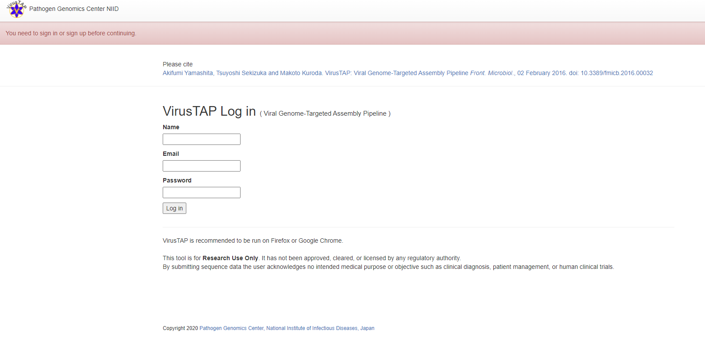
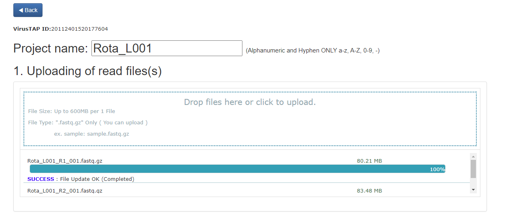

# metagenomics training

In this report you will find all the information necessary to follow the steps to run a basic metagenomics analysis.

## Training overview
During this training we will following these steps:
* [Mapping](#mapping): Introduction to mapping.
* [Assembly](#assembly): Introduction to assembly.
* [Register/Login](#register/login): Register or login into VirusTAP and Galaxy.
* [Data](#data): Upload data for the analysis.
* [Parameters/Steps](#parameters/steps): Select the desired parameters and steps for the pipeline.
* [Run/Results](#run/results): Execute and explore the results.
* [Kraken](#kraken): K-mer mapping approach using Galaxy.
* [Combined approach](#combinedapproach): Both mapping and assambly can be combined to better understand your sample.

## Mapping

Mapping is a type of alignment that consist in placing a sequence inside a larger sequence. For example, it is used to determine the position of a read or contig in a reference genome.

This approach is useful when you have a reference genome for the same species of the organisms you are working with, it is faster than a *de-novo* assambly, and also allows variant discovery.

## Assembly

Assembling consist in reconstructing a representation of the original sequenced genome from shorter fragments generated by the sequencer machine called reads. It does not need a reference genome, and it is very uncommon the whole genome is reconstructed; they usually return only contigs that have to be elongated into scaffolds. Between those contigs there will be gaps, portions of the genome that could not be rebuilt.

This approach takes longer to compute, but it can discover new genomes.

## Register/login

In order to access VirusTAP, you first will need to log in or create a new academic account at [VirusTAP](https://gph.niid.go.jp/virustap/system_in):

## Data

We will start by giving a name to our analysis and uploading the raw data. In our case, we are going to use the files `Rota_L001_R1_001.fastq.gz` and `Rota_L001_R2_001.fastq.gz`. For this server, the data has to be compressed in this specific format.

