# SARS-CoV-2 training with Galaxy

**In this report, you will find all the information necessary to follow the steps to analyze SARS-CoV-2 data with Galaxy.**

## Training 

During this training, we will be following these steps:

* [**Register/Login**](#registerlogin): Register or login into Galaxy's website.
* [**Data**](#data): Upload data for the analysis.
* [**Quality**](#quality): Analysis of the quality of the raw reads.
* [**Trimming**](#trimming): Quality trimming using fastp.
* [**Mapping**](#mapping): Mapping reads to reference genome with Bowtie2.
* [**Stats**](#stats): Mapping statistics with Picard
* [**Amplicons**](#amplicons): Preprocessing steps mandatory for amplicon sequencing data.
* [**Variants**](#variants): Variant calling and annotation.
* [**Consensus**](#consensus): Consensus genome generation.
* [**Additional info**](#additional-info): Websites for additional info.

## Register/Login

First of all, you have to create a user (or login into your user if you already have one) in the [**European Galaxy website**](https://usegalaxy.eu/) by clicking on the button shown in the following image:


You can do this analysis without creating a user, but your history will be saved into your user so you can access later at home.

Once you are registered, we can start with the analysis workflow.

***From now on, each job we run in Galaxy will have a unique number to identify each process. These numbers can differ depending on the number of samples and the times you run or delete a certain process. This training's snapshots were taken using two samples and some processes were deleted for any reason, so numbers MAY DIFFER. Additionally, this exercise's snapshots were taken with another dataset, so sample names may differ as well.***

## Data

Before starting with the analysis, we need to **upload the data** we want to analyze with Galaxy. There are several ways to upload data into Galaxy. In this training, we will show you some of the most common ones.

### Uploading data given a URL

In order to upload files from a URL, we should follow these steps:

1. In the left side panel, select **Upload**.
2. In the new panel select **Paste/Fetch Data**.
3. Then copy the following block of text for the samples:

```bash
https://zenodo.org/record/5724464/files/SARSCOV2-1_R1.fastq.gz?download=1
https://zenodo.org/record/5724464/files/SARSCOV2-1_R2.fastq.gz?download=1
```

4. Now, in the **Download data from the web by entering URLs (one per line) or directly paste content** square, paste the text you copied before.
5. Select **Start**.
6. When everything is green in the screen, select **Close**.

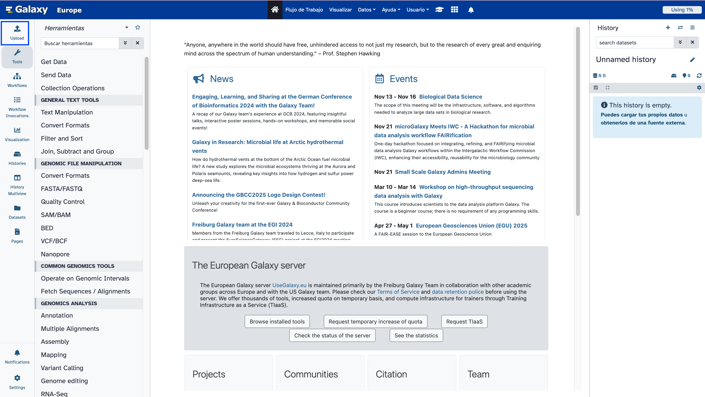


Once files have been uploaded, we can close the window by clicking on the *Close* button. Both files will then appear in the right panel.

If we select the "eye" symbol in the datasets from the history, we can see the content of the data:

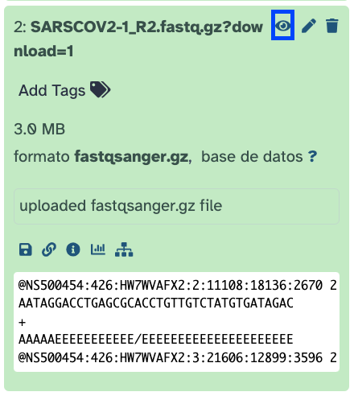

## Quality

### Quality Analysis (FastQC)

Once we have the raw data, a first important step is to analyze the quality of the reads, in order to know if the reads are worth it. To do this, we have to:

1. Search for the **FastQC** tool in the left panel.
2. Select **FastQC Read Quality reports** in that panel and set the following parameters:
   1. Select _**Multiple datasets**_ in _**Raw read data from your current history**_
   2. Select in the bar the two datasets from the history.
   3. Go down and select _**Run tool**_.

<p align="center">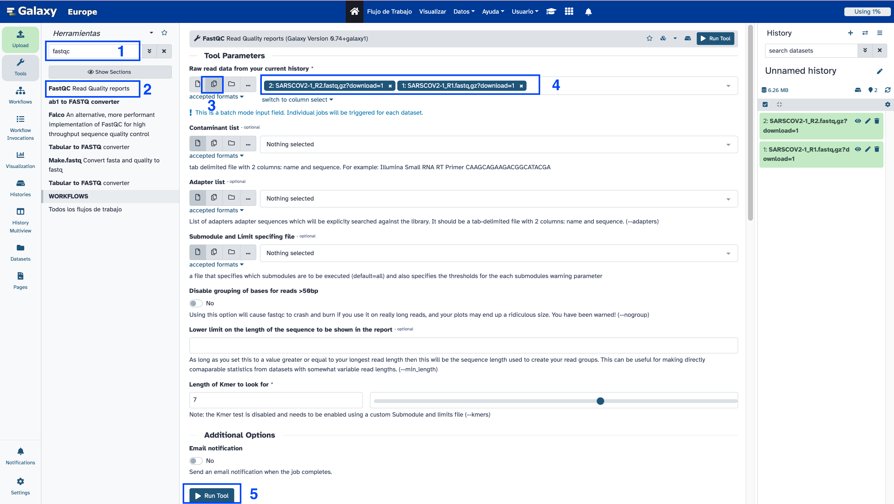</p>

This software will generate a message like the following, in which we can read that each .fastq file is going to generate two different jobs, one for the Raw Data and another one for the corresponding HTML report.

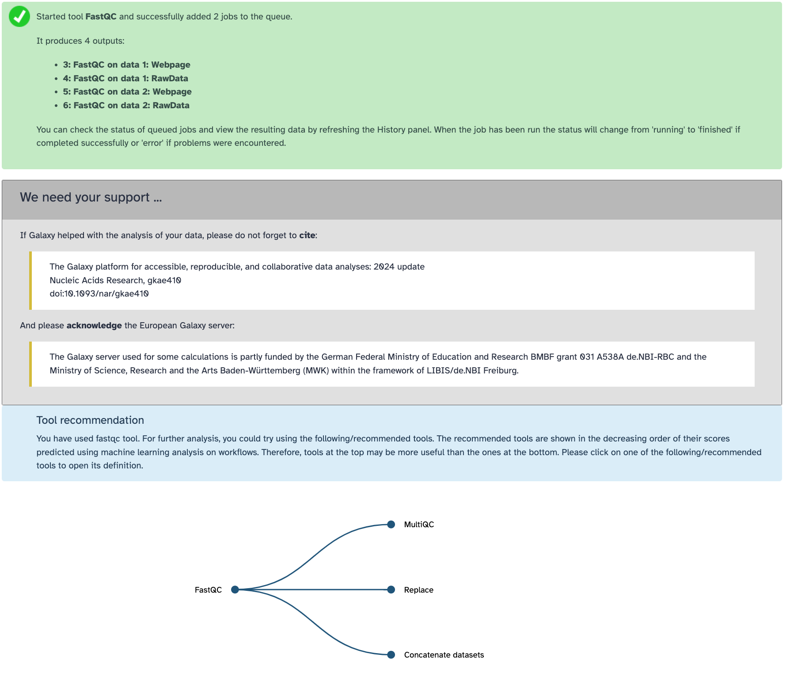

#### FastQC results visualization

To visualize the information resulting from the executiong of FastQC, we just have to select the job of interest in the History tab. In this case, we are interested in the "_**Web page results**_", so for the sample we want to see the results we'll have to click in the _eye_ symbol to visualize Galaxy's results:

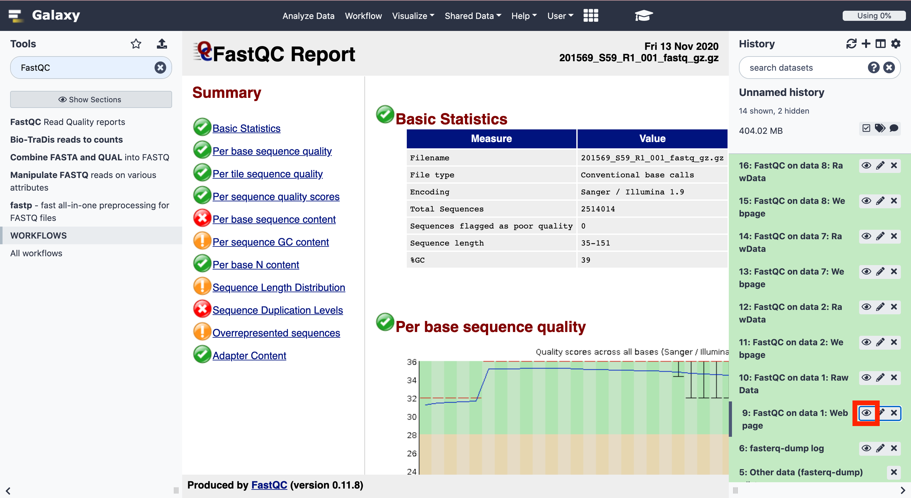

This report provides different types of information about the sequencing quality of the reads. By clicking in the arrows in the bottom right/left corners of the page we can hide/show the side panels.


So the central panel with the results we want to visualize will be seen better.


**_For more information about FastQC's output visit [**FastQC's website**](https://www.bioinformatics.babraham.ac.uk/projects/fastqc/Help/3%20Analysis%20Modules/)_**.

## Trimming

### Quality trimming (Fastp)

Once we have checked the quality of our reads, it's important to trim low quality positions from those reads, for which we will use **_Fastp_**. Given this, in the _Tools_ bar you should now look for **fastp** and then select "_**fastp - fast all-in-one preprocessing for FASTQ files**_". Once there, we will have to change some parameters so as to have enough trimming accuracy for this amplicon data. We will run the analysis for the sample we gave you. These are the fields we will have to change for this process:

1. Single-end or paired reads > **Paired Collection**.

>[!WARNING]
To use this option from Fastp, it is necessary to first create a **list of paired datasets**, given our .fastq files, which will then be used for the rest of the steps of this workshop. In order to do so, we must:
>
>1. Select our fastqsanger.gz files that we uploaded in the beginning, and then click on _2 of X selected_.
>2. Select _Advanced Build List_.
>3. Select the _List of Paired Datasets_ box and click on *Next*.
>4. Check the auto-pairing configuration and click again on *Next*.
>5. Give a name to your list and finally click on *Build*.
>
> Once this is done, you'll be able to select your list as input of Fastp.

2. Select paired collection(s) > Select your list (`SARS-CoV-2`)
  
3. Display **Filter Options**
   - Quality filtering options
     - Qualified Quality Phred = **20**
     - Unqualified percent limit = **10**

   - Length Filtering Options
     - Length required = **50**

4. Read modification options
   * PoliX tail trimming > **Enable polyX tail trimming**

5. Per read cutting by quality options
   * Cut by quality in front (5') > **Yes**
   * Cut by quality in tail (3') > **Yes**

6. **Run Tool**

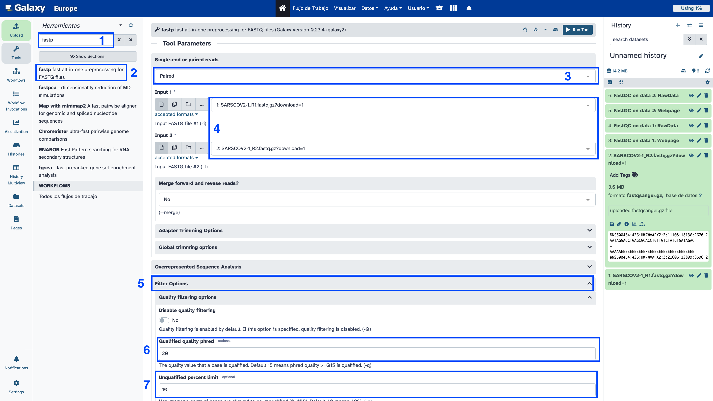
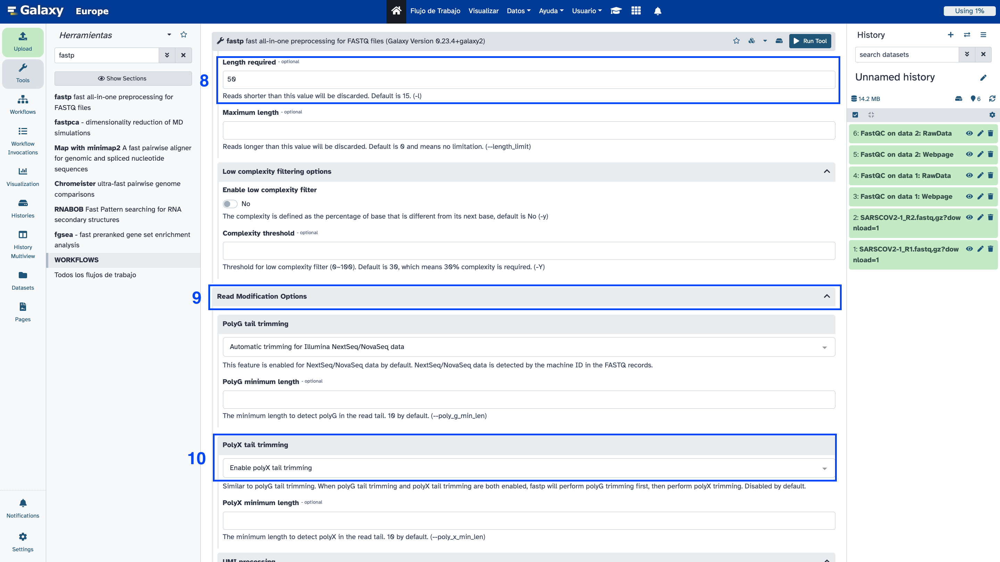
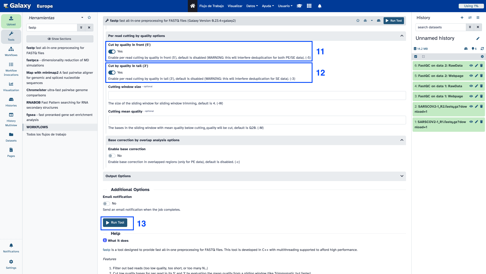

A message like this will appear, which means that 4 results will be generated:

  1. One with the R1 trimmed reads: `fastp on data 2 and data 1: Read 1 output`.
  2. Another one with the R2 trimmed reads: `fastp on data 2 and data 1: Read 2 output`.
  3. Another one with the HTML results: `fastp on data 2 and data 1: HTML report`.
  4. A last one which is not relevant for this training.

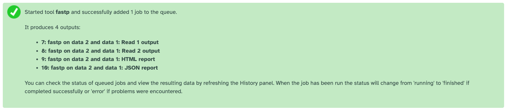

#### Fastp results

Once the Fastp analysis is done, you can see the results by clicking in the eye ("_View_") symbol in the fastp HTML results. You will see a report like the following:


This report can be downloaded by clicking on the results name ("_fastp on data 2 and data 1: HTML report_") and then on the "_Download_" symbol.

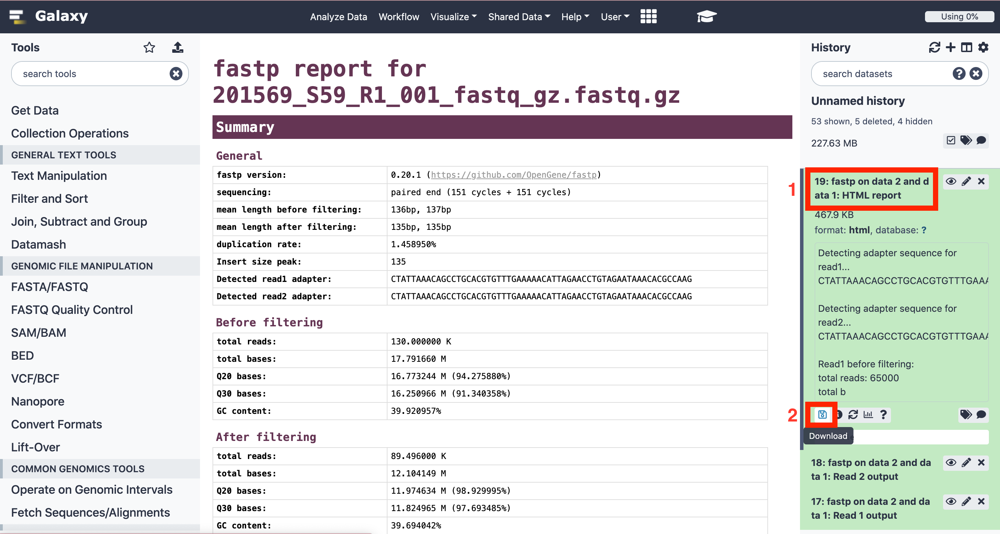

This will download a .zip folder that contains the .html report, which can be visualized in your computer using any browser (such as Google Chrome). You can interactively scroll around the results as well.

Among the most relevant results, you have the:

- **Summary**: Stats summary.
  - **After filtering**: Statistics of the reads after quality filtering.
    - reads passed filters: Reads remaining after quality filter trimming.
    - reads with low quality: Reads that were removed due to low quality.
    - reads too short: Reads that didn't pass the minimum length filter.
  - **After filtering**: Plots after filtering.
    - After filtering: read1: quality: Plot with the evolution of R1 quality over read position. Usually it decays in the last nucleotides.
    - After filtering: read2: quality: Same plot for R2.

**_For more information about Fastp output visit [Fastp GitHub's page](https://github.com/OpenGene/fastp)_**.

>If you are working with more samples, don't forget to run [trimming steps](#quality-trimming-fastp) with the rest.

## Mapping

In order to call for variants between the samples and a given reference, it's mandatory to map the sample reads to such reference genome. To do this, we need the **FASTA** file of the **reference** and the **Bowtie2** **index** of that fasta file.

### Mapping reads with reference genome (Bowtie2)

Now we can start with the main mapping process. The first thing we have to do is to look for the program "_**Bowtie2**_" in the search bar and then select "_**Bowtie2 - map reads against reference genome**_". Here we will have to set the following parameters:

1. Is this single or paired library > **Paired-end**

2. FASTQ Paired Dataset > **fastp on collection X: Paired-end output**

3. Will you select a reference genome from your history or use a built-in index? > Use a built-in genome index > **SARS-CoV-2 isolate Wuhan-Hu-1, complete genome (NC_045512.2)**

4. Do you want to use presets? > **Very sensitive local**

5. Save the bowtie2 mapping statistics to the history > **Yes**

6. **Run tool**


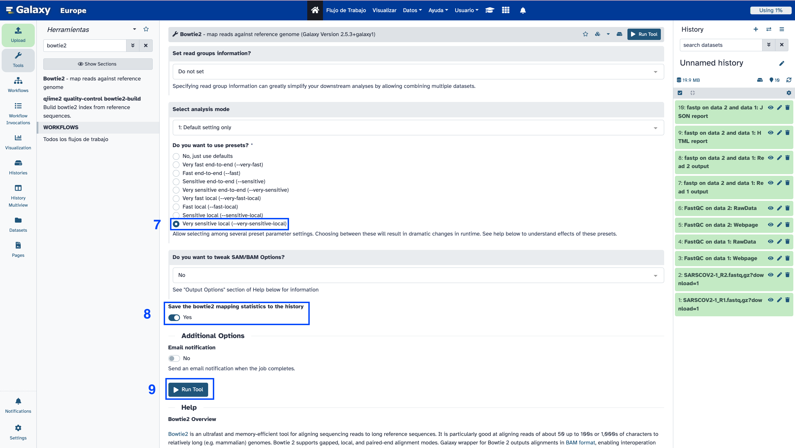

We will see a message like this one:

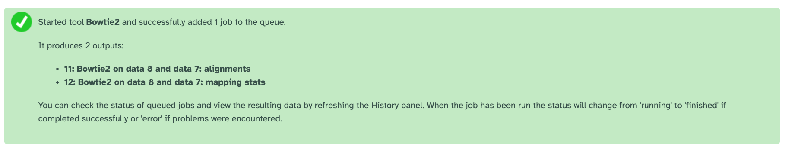

#### Mapping results

Now we can see the mapping results for the samples. The bowtie2 resulting file is a **.bam** file, which is not easy to read by humans. This .bam file can be downloaded by clicking on the alignment file and then on the *Download* symbol. Then, the resulting .gz file will contain the alignment .bam file that can then be introduced in a software such as [**Integrative Genomics Viewer**](http://software.broadinstitute.org/software/igv/) along with the reference genome FASTA file.


In our case, the file that can be visualized is the statistics file, which contains information such as the percentage of reads that aligned to the reference genome.

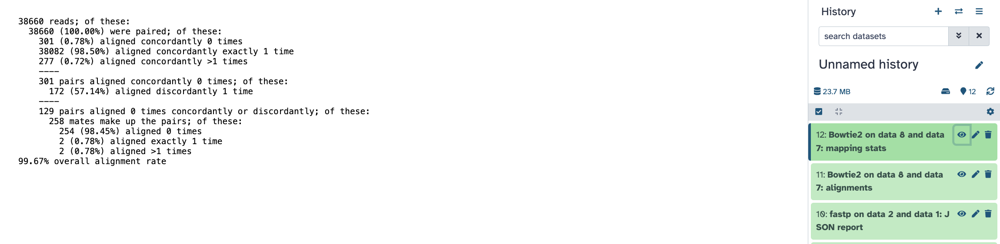

## Stats

The previously shown files provide few human readable information, because mapping files are supposed to be used by other programs. In this sense, we can use some programs to extract relevant statistical information about the mapping process.

### Picard CollectWgsMetrics

Another program that gives statistical information about the mapping process is **Picard**. To run this program you just have to search "_**CollectWgsMetrics**_" and then select "_**CollectWgsMetrics compute metrics for evaluating of whole genome sequencing experiments**_".

1. Select SAM/BAM dataset or dataset collection > Dataset collection > **Bowtie2 on collection X: alignments**
2. Using reference genome > **SARS-CoV-2 isolate Wuhan-Hu-1, complete genome (NC_045512.2)**
3. **Run tool**

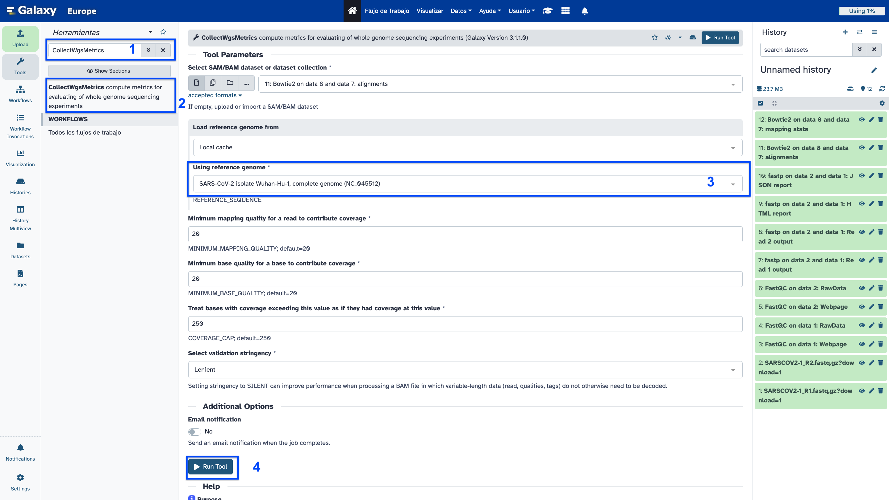

This process will generate one output file per .bam alignment file selected as input.

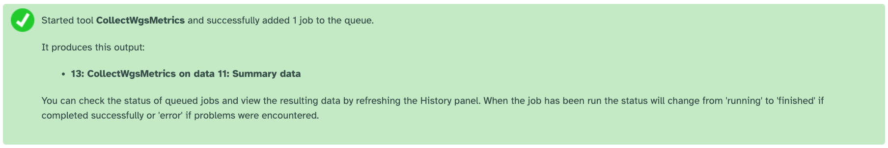

#### Picard results

Picard results consist in quite long files, so the best thing to do is to download these results and visualize them in your computer. You have to click on the CollectWgsMetrics job you want to download, and then click on the *Save* button:


Then you just have to open the file with Excel in your computer, and you will see a file with different columns with information about the percentage of the reference genome that is covered by the reads at a specific depth or the mean depth of coverage of the reference genome.

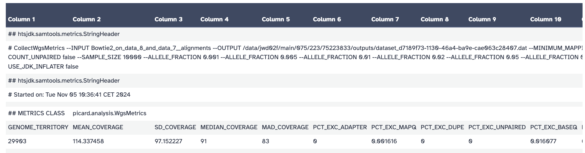

Given this example, in the results table, you can see that the "Mean Coverage" is around 115, which means that each position in the reference genome is supported by 115 reads, by mean. The "PCT 10X" represents the percentage of the reference genome that is sequenced with a 10X depth, which represents the percentage of the reference genome that is at least sequenced 10 times (79,57%).

## Amplicons

After mapping the reads to the reference genome, we are interested in removing the sequences of the amplicon primers. To do that, you will use a program called **iVar**, and you will need a **.bed** file with the positions of those amplicon primers.

### Trim amplicon sequences

You have to search for "_**ivar trim**_" in the search bar and then select "_**ivar trim Trim reads in aligned BAM**_". Then follow these steps:

1. Bam file > **Bowtie2 on collection X: alignments**
2. Source of primer information > **Built-in**
3. Primer scheme name > **SARS-CoV-2 ARTICv3**
4. Include reads not ending in any primer binding sites? > **Yes**
5. Require a minimum length for reads to retain them after any trimming? > **Yes, and provide a custom threshold**
6. Minimum trimmed length threshold = **20**
7. **Run tool**

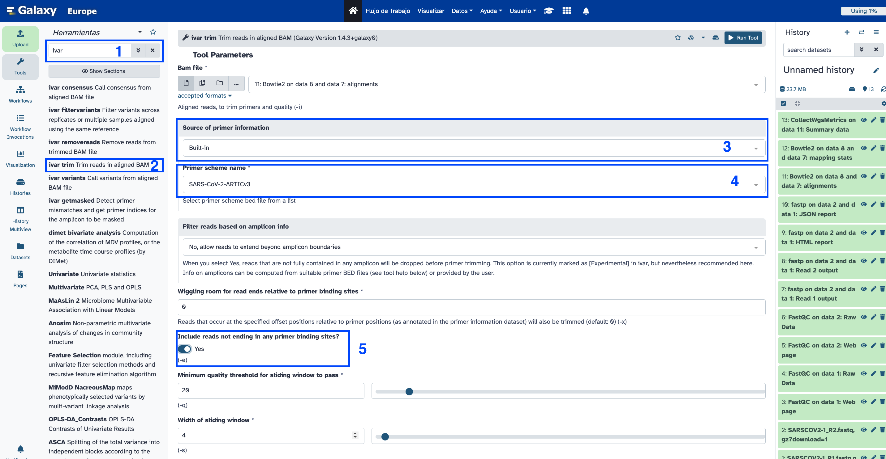

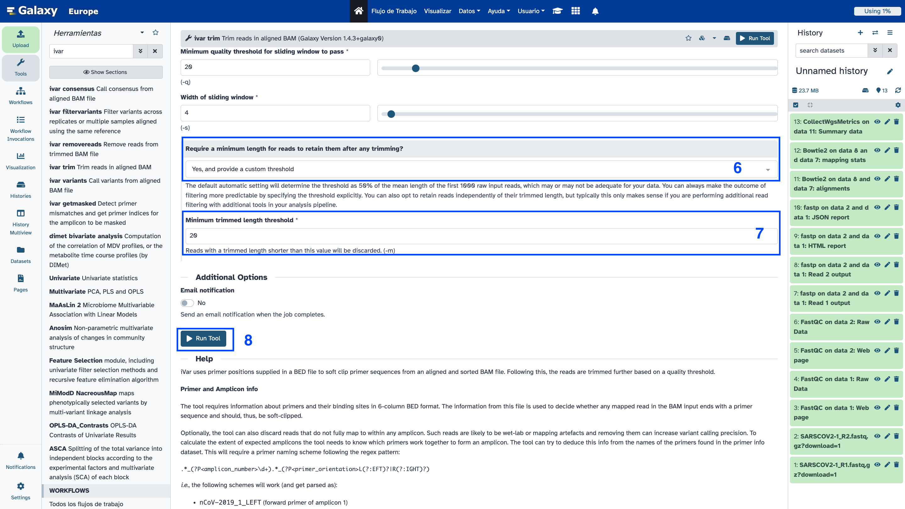

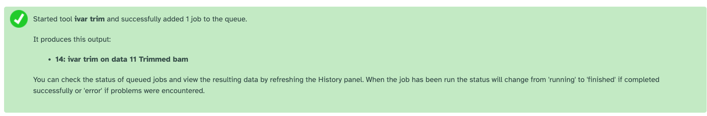

#### iVar trimming results

The resulting file from iVar will be a new **BAM** file in which amplicon primer positions will have been removed, so **there's no result to visualize**.

## Variants

Once we have the alingment statistics and files with amplicon primers trimmed, we can start with the **variant calling** process.

### iVar

#### Reference genome to call for variants

We have to upload the FASTA reference genome, and we will do it using the following URL:

```bash
https://zenodo.org/record/5724970/files/GCF_009858895.2_ASM985889v3_genomic.200409.fna.gz?download=1
```

You have to copy the previous URL direction, and then select "_**Download from web or upload from disk**_", then select "_**Paste/Fetch data**_" and in the new window that appears you should paste the URL above and finally select "_**Start**_". Now the FASTA file of the reference has been downloaded.

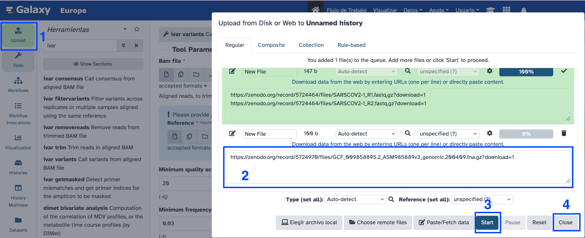

In order to call for variants between the sample and the reference, we will use **iVar variants**, so you have to search for "_**ivar**_" in the search bar and select "_**ivar variants Call variants from aligned BAM file**_". Then, select the following parameters:

1. In "**Bam file**", make sure you've selected ivar trim on collection X Trimmed bam
2. **Reference** > `GCF_009858895.2_ASM985889v3_genomic.200409.fna.gz?download=1`
3. **Minimum frequency threshold** > 0.25
4. **Output format** > Both Tabular and VCF
5. **Run tool**

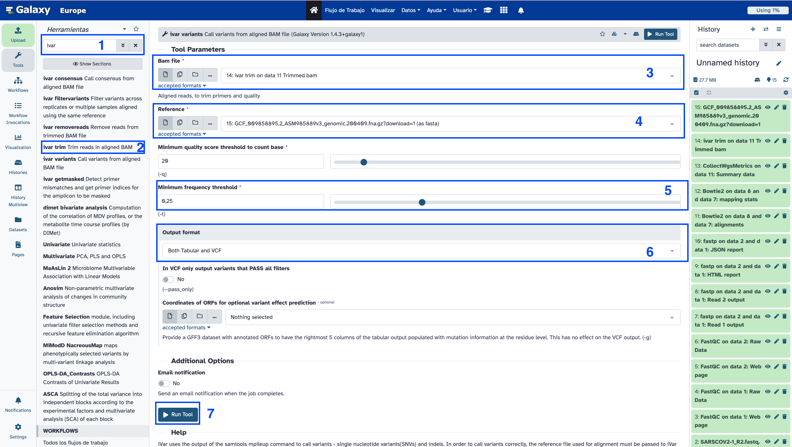

iVar will create two output files per each bam file uploaded, one with the tabular results, and another one with the vcf files.

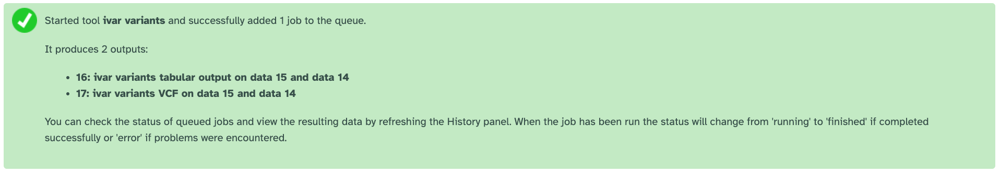

#### iVar results

To display iVar variants results, select the __eye__ icon in the right pannel of the Tabular results and then extend the central panel by clicking on the arrows in the bottom.

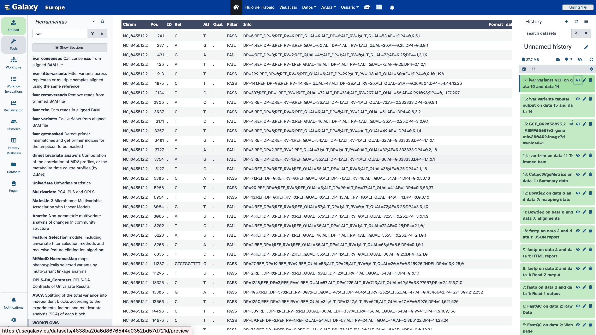

iVar results consist in a Tab separated file containing all the variants found between the reference and the sample with an Allele Frequency higher than the specified threshold (0.25 in our case). Each line represents a variant and the columns provide information about that variant, such as the position in the reference genome, the reference allele, the alternate allele, if that variant passed the filters, and so on.

These variants have passed a filter for the minimum quality, which we set as 20, as well as the allele frequency threshold. However, we will have a closer look only to those variants present with an allele frequency higher than 0.75, which are the ones that will be included later on in the consensus sequence.

### Annotation with SnpEff

Once we have called the variants, it's interesting to annotate those variants, for which we will use **SnpEff**. Search for "_**snpeff**_" in the searh bar and then select "_**SnpEff eff: annotate variants for SARS-CoV-2**_", then change the following parameters:

1. In "Sequence changes (SNPs, MNPs, InDels)", make sure to select: **ivar variants VCF on collection X**.
2. Create CSV report, useful for downstream analysis (-csvStats) > **Yes**
3. **Run tool**

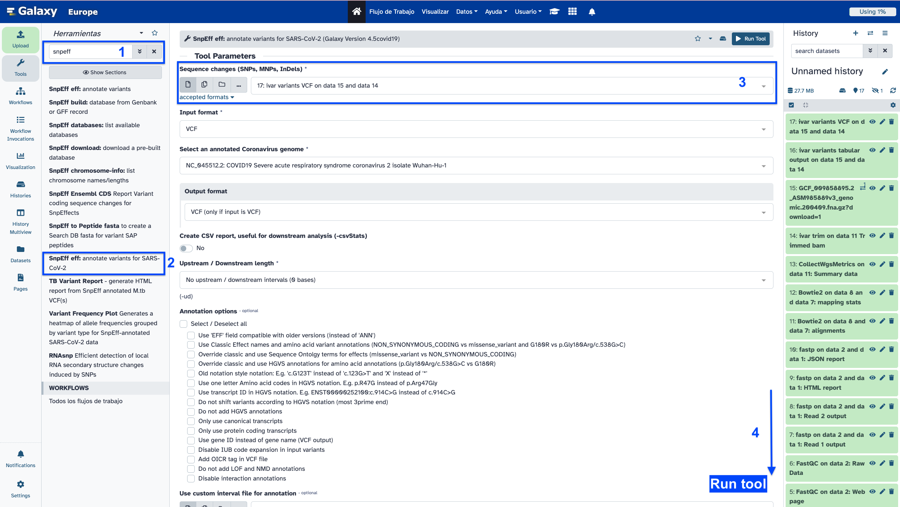
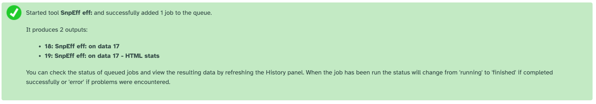

### SnpEff results

SnpEff provides three different results, from which the most interesting ones are the following:

1. **Snpeff eff**: This is a VCF file with the annotation results. It is a very similar file to the ones we saw before, but in this case with the last column being different, which contains relevant information about each variant.

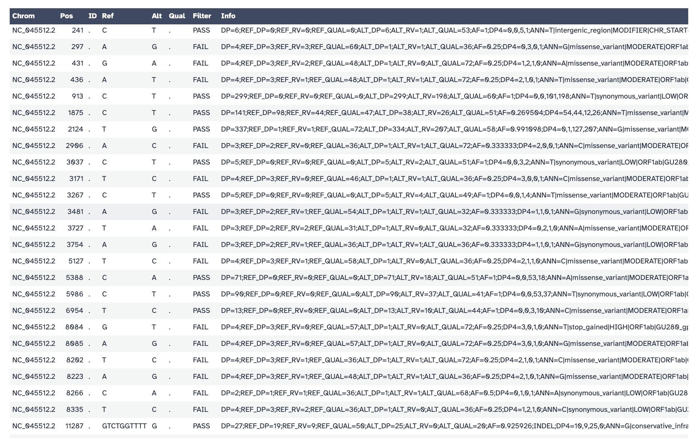

2. Snpeff eff **HTML stats**: This file is an HTML file that contains statistics about the variant annotation process, such as the percentage of variants annotated, the percentage of variants that are MISSENSE or SILENT, the percentage that have HIGH, MODERATE or LOW effect, and so on.

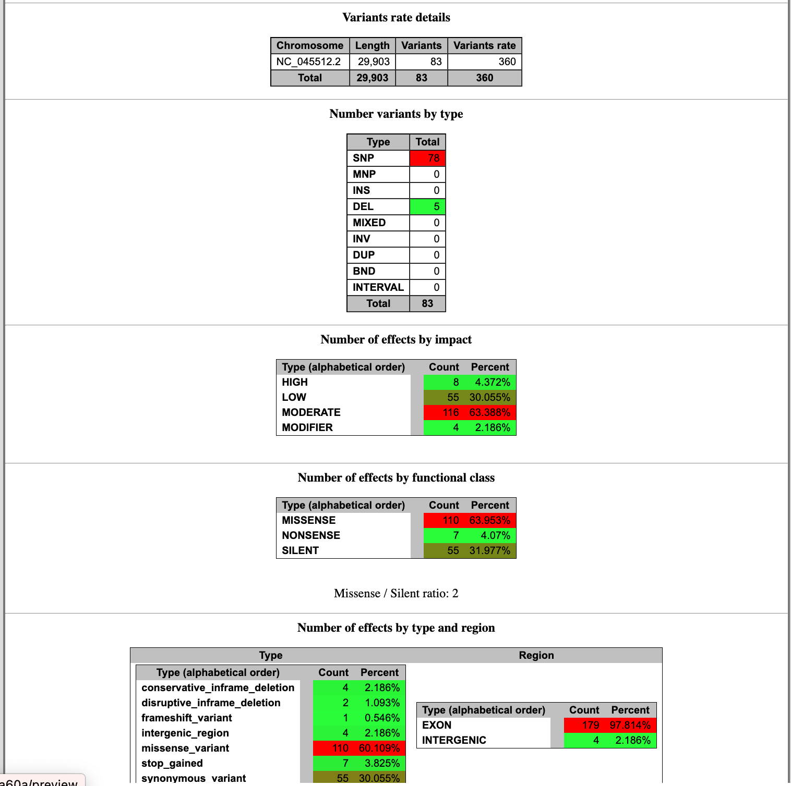

## Consensus

Once we have the most relevant variants that can be considered to be included in the consensus genome, you can start with the **consensus genome generation**.

### iVar consensus

Now we are going to generate the consensus genome using **iVar**. For this, we will look for _**ivar**_ and the select "_**ivar consensus Call consensus from aligned BAM file**_". Now, follow these steps:

1. In "BAM file", make sure you have selected: **ivar trim on collection X Trimmed bam**.
2. **Minimum frequency threshold** > `0.75`
3. **Run tool**

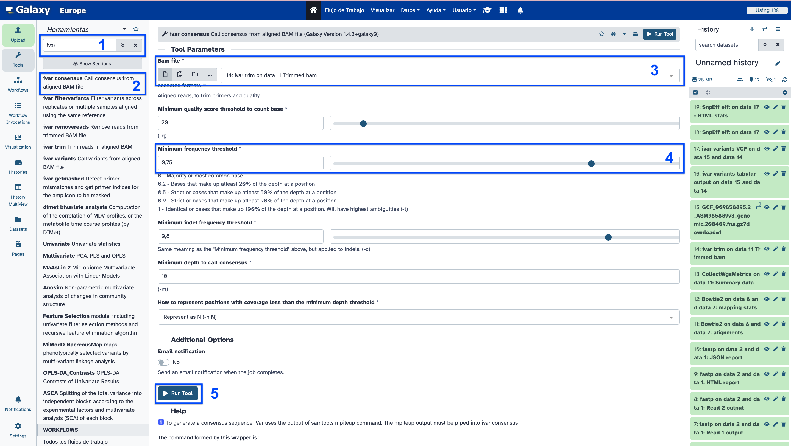

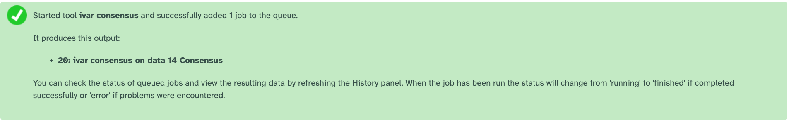

This process will just generate a FASTA file identical to the reference one, except for those positions that are variants given the corresponding VCF file.

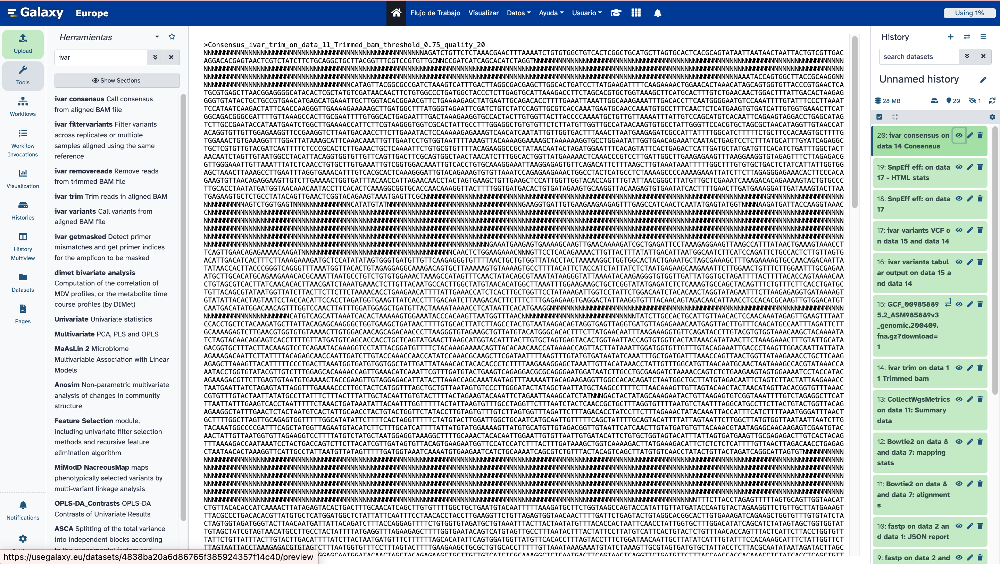

## Lineage

Next, we will determine the **lineage** of the samples. We will use a software called **pangolin** for this purpose. We will use the masked consensus genome generated in the previous steps as follows:

1. Search for the **pangolin** tool in the Tools panel.
2. Select **Pangolin Phylogenetic Assignment of Outbreak Lineages**.
3. In "Input FASTA File(s)", please select the consensus sequence generated in the previous step (ivar consensus on collection X Consensus).
4. Version of pangolin-data to use > `Download latest pangolin-data version from web`.
5. Version of constellations to use > `Download latest pangolin-data version from web`.
6. **Run tool**

<p align="center">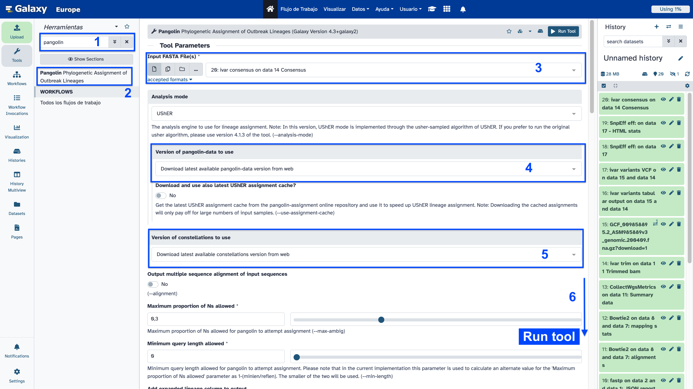</p>

<p align="center">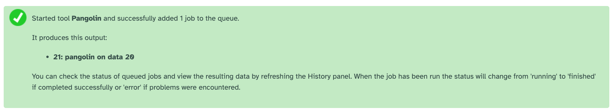</p>

Now let's have a look to the **results** from pangolin:

<p align="center">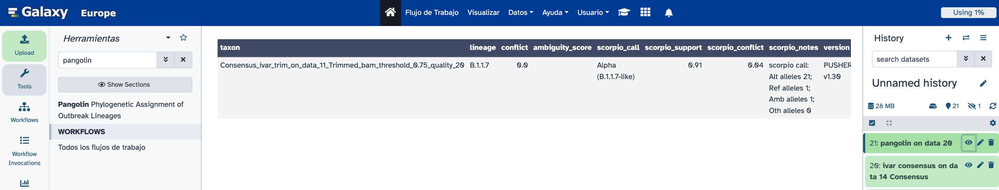</p>

As you can see, results are in table format, where you have in first place the reference genome, then the **lineage** assigned, which seems to be [**B.1.1.7 lineage**](https://www.cdc.gov/coronavirus/2019-ncov/variants/variant-info.html) in this case. This lineage corresponds, as you can see in the 5th column, to the **Alpha** lineage.

## All results

If you have any issues following this training and you want to visualize the resulting files, you can access them through [**this URL**](https://usegalaxy.eu/u/svarona/h/sars-cov-2-1).

And viralrecon workflow can be consulted in [**this URL**](https://usegalaxy.eu/u/svarona/w/viralreconupdated).

## Additional info

* [**GISAID**](https://gisaid.org/): The **GISAID Initiative** promotes the fast sharing of data from all influenza viruses and the coronavirus causing COVID-19. This includes genetic sequence and related clinical and epidemiological data associated with human viruses, and geographical as well as species-specific data associated with avian and other animal viruses, in order to help researchers understand how viruses evolve and spread during epidemics and pandemics.
* [**ENA**](https://www.ebi.ac.uk/ena/browser/): The **European Nucleotide Archive** (ENA) provides a comprehensive record of the world’s nucleotide sequencing information, covering raw sequencing data, sequence assembly information and functional annotation.
* [**Nextstrain**](https://nextstrain.org/ncov/gisaid/global/6m): **Nextstrain** is a project to harness the scientific and public health potential of pathogen genome data. Their goal is to aid epidemiological understanding of pathogen spread and evolution and improve outbreak response.
* [**outbreak.info**](https://outbreak.info/): **Outbreak.info** aggregates data across scientific sources, providing tools to meet three major aims: (1) Track daily developments in SARS-CoV-2 variants, (2) Integrate publications, preprints, clinical trials, datasets, protocols, and other resources into one searchable library of COVID-19 research, and (3) Track trends in COVID-19 cases and deaths.