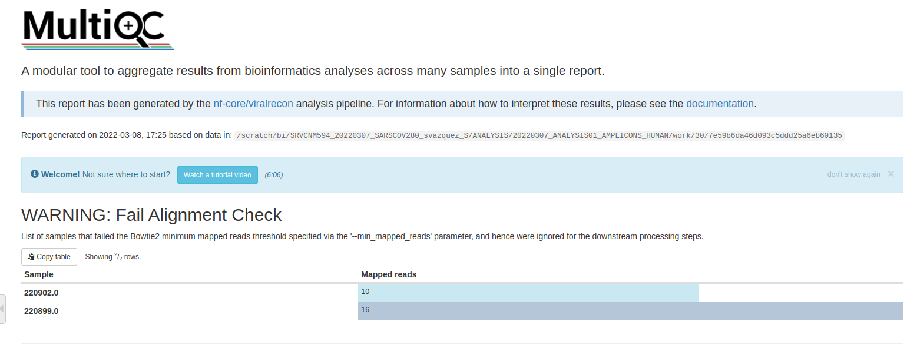
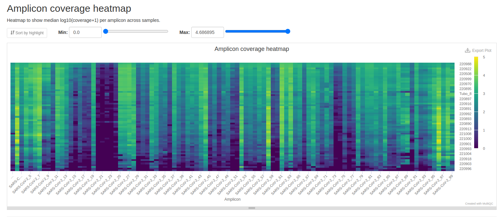
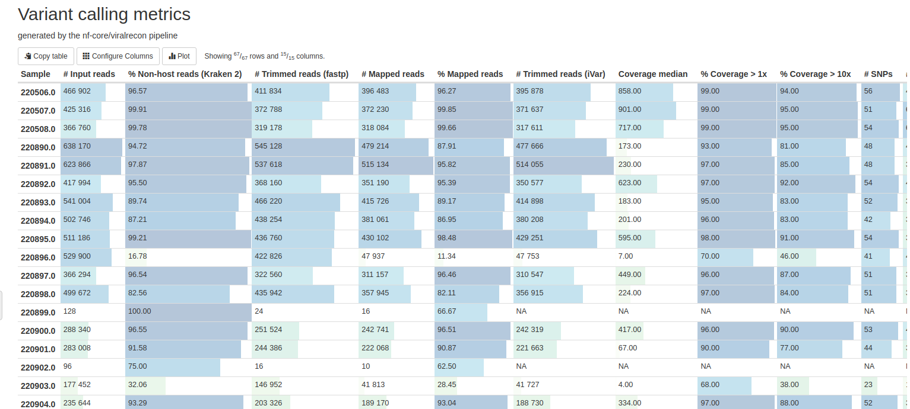
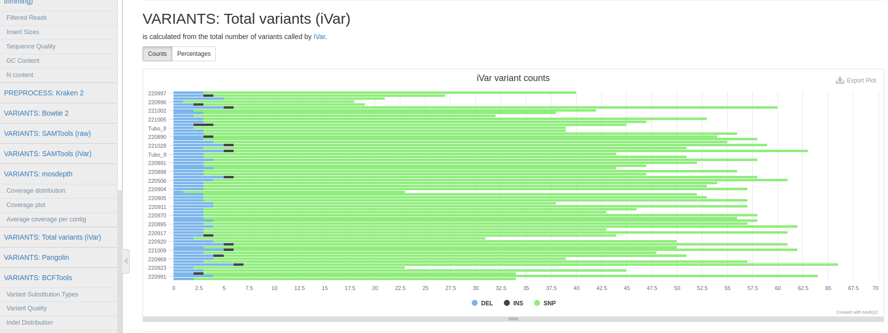
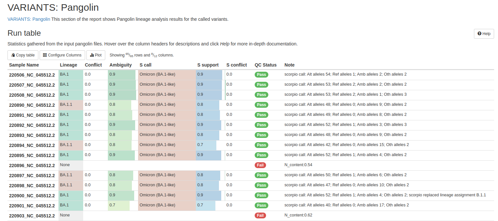

# SARS-CoV-2 training using Nextflow

In this tutorial you will find all the information necessary to analyze SARS-CoV-2 data with Nextflow.

## Training overview
During this training we will following these steps:
- [SARS-CoV-2 training using Nextflow](#sars-cov-2-training-using-nextflow)
	- [Training overview](#training-overview)
	- [Before class tasks](#before-class-tasks)
		- [Dependencies](#dependencies)
		- [Pipeline download](#pipeline-download)
		- [Data download](#data-download)
	- [Class exercise](#class-exercise)
		- [Overview](#overview)
		- [Running the pipeline](#running-the-pipeline)
		- [Results](#results)
	- [Statistics](#statistics)

## Before class tasks

### Dependencies

We will need the following dependencies to run this tutorial:

- [conda](https://docs.conda.io/en/latest/miniconda.html): In case you haven't install conda yet, follow the instructions in [this link](https://docs.conda.io/en/latest/miniconda.html)
- [nf-core tools](https://github.com/nf-core/tools) A python package with helper tools for the nf-core community.
- [singularity](https://sylabs.io/guides/3.5/user-guide/introduction.html) is a container platform. It allows you to create and run containers that package up pieces of software in a way that is portable and reproducible.
- [Nextflow](https://www.nextflow.io/) is a bioinformatics workflow manager that enables the development of portable and reproducible workflows. It supports deploying workflows on a variety of execution platforms including local, HPC schedulers, AWS Batch, Google Cloud Life Sciences, and Kubernetes. Additionally, it provides support for manage your workflow dependencies through built-in support for Conda, Docker, Singularity, and Modules.

1. We will install them using a conda environment:

```
conda create --channel bioconda --channel conda-forge --name nf-core python=3.7 nf-core==2.7.2 nextflow==22.10.6 singularity==3.8.4
conda activate nf-core
```

2. Test if it's correctly installed:

```
nextflow -v
# nextflow version 22.10.1.5660
singularity --version
# singularity version 3.8.4
nf-core --version
nf-core, version 2.7.1
```

### Pipeline download

1. First of all go to somewhere in your home and create a directory for this training exercise

```
mkdir viralrecon_tutorial
cd viralrecon_tutorial
```

2. We are going to use [nf-core tools](https://nf-co.re/tools/) for downloading the pipeline and the singularity images:

```
nf-core download --container singularity --revision 2.6.0 --compress none viralrecon
# Define $NXF_SINGULARITY_CACHEDIR for a shared Singularity image download folder? [y/n]: -> n
```

### Data download

We are using a training dataset from Zenodo: https://zenodo.org/record/5724970#.ZCFP83ZBxEY

1. Create a folder for downloading the files.
```
cd /path/to/viralrecon_tutorial
mkdir data
```

2. Download files manually or using wget.
```
cd data
curl --output GCA_009858895.3_ASM985889v3_genomic.gff.gz https://zenodo.org/record/7773842/files/GCA_009858895.3_ASM985889v3_genomic.gff.gz?download=1
curl --output GCF_009858895.2_ASM985889v3_genomic.200409.fna.gz https://zenodo.org/record/7773842/files/GCF_009858895.2_ASM985889v3_genomic.200409.fna.gz?download=1
curl --output kraken2_hs22.tar.gz https://raw.githubusercontent.com/nf-core/test-datasets/viralrecon/genome/kraken2/kraken2_hs22.tar.gz
curl --output nCoV-2019.artic.V3.scheme.bed https://zenodo.org/record/7773842/files/nCoV-2019.artic.V3.scheme.bed.txt?download=1
curl --output SARSCOV2-1_R1.fastq.gz https://zenodo.org/record/7773842/files/SARSCOV2-1_R1.fastq.gz?download=1
curl --output SARSCOV2-1_R2.fastq.gz https://zenodo.org/record/7773842/files/SARSCOV2-1_R2.fastq.gz?download=1
curl --output SARSCOV2-2_R1.fastq.gz https://zenodo.org/record/7773842/files/SARSCOV2-1_R1.fastq.gz?download=1
curl --output SARSCOV2-2_R2.fastq.gz https://zenodo.org/record/7773842/files/SARSCOV2-1_R2.fastq.gz?download=1
```

## Class exercise

### Overview

[viralrecon](https://github.com/BU-ISCIII/viralrecon) is a bioinformatics analysis pipeline used to perform assembly and intra-host/low-frequency variant calling for viral samples. The pipeline supports short-read Illumina sequencing data from both shotgun (e.g. sequencing directly from clinical samples) and enrichment-based library preparation methods (e.g. amplicon-based: ARTIC SARS-CoV-2 enrichment protocol; or probe-capture-based).

The pipeline is built using Nextflow, a workflow tool to run tasks across multiple compute infrastructures in a very portable manner. It comes with Docker containers making installation trivial and results highly reproducible. Furthermore, automated continuous integration tests that run the pipeline on a full-sized data set using AWS cloud ensure that the code is stable.

### Running the pipeline

1. Create sample_sheet

```
ls data/*.fastq.gz | cut -d "/" -f 2 | cut -d "_" -f 1 | sort -u > samples_id.txt
echo "sample,fastq_1,fastq_2"
cat samples_id.txt | xargs -I % echo "%,data/%_R1.fastq.gz,data/%_R2.fastq.gz" > samplesheet.csv
 ```
To run the pipeline you have to type in your terminal:

```
cd /path/to/viralrecon_tutorial
nextflow run ./nf-core-viralrecon-2.6.0/workflow/main.nf -profile singularity --input samplesheet.csv --fasta data/GCF_009858895.2_ASM985889v3_genomic.200409.fna.gz --gff  data/GCA_009858895.3_ASM985889v3_genomic.gff.gz--outdir viralrecon_results --skip_assembly --skip_asciigenome
```

This is the pipeline overview:
1. FastQC: Quality control
2. Fastp: Quality+size trimming
3. Mapping approach:
	1. bowtie2: Mapping to the reference genome
	2. ivar: Amplicon's adapter trimming by position
	3. ivar: Variant calling
	4. bcftools: Consensus generation

### Results
Now we are going to see the most important results of the pipeline. In case you were not able to run the pipeline, you can see the [results in this folder](../results/).

One of the most interesting results is the [MultiQC report](../results/multiqc/multiqc_report.html). In this report you have an overview of all the steps of the pipeline and their results.

The first results consist in a summary of the samples that failed in the analysis.



One of the first results that appears is the Amplicon coverage heatmap, which can be used to see which amplicon primers performed better or worst than others.



Then you have a summary of the most important metrics in the analysis, that we will see later in the statistics results:



You can interactively move across the report to see more results, such as the number of variants called by iVar for each sample in a barplot.



Also, this report shows the lineage assigned to the samples, and you can sort the columns as you wish:



Another interesting result is a table that contains all the variants per sample with the variant annotation and the lineage assigned to that sample. The columns of the table are:

- SAMPLE: Sample name
- CHROM: Reference genome chromosome identifier
- POS: Variant's position
- REF: Reference allele
- ALT: Alternative allele (variant)
- FILTER: Column indicating if the variant passed the filters. If all filters are passed, PASS is written in the filter column. If not, the filter that wasn't passed will be indicated.
- DP: Position depth.
- REF_DP: Ref allele depth
- ALT_DP: Alternative allele depth
- AF: Allele Frequency
- GENE: Gene name in annotation file​
- EFFECT: Effect of the variant
- HGVS_C: Position annotation at CDS level
- HGVS_P: Position annotation at protein level
- HGVS_P_1LETTER: Position annotation at protein level with the aminoacid annotation in 1 letter format
- CALLER: Variant caller used
- LINEAGE: Lineage assigned by pangolin.

This table can be really helpful to filter variants by lineage, or by position, so you can see the relationship between lineages and variants. Also this table includes all the called variants, so you can also see those low frequency variants that were not included in the consensus.

## Statistics
The most important results of the MultiQC report can be found in a comma separated values (csv) file (summary_variants_metrics_mqc.csv) with the most important statistics. This file contains the following columns:

- Sample: Sample name
- Input reads: Number of raw reads before trimming
- Trimmed reads (fastp): Number of reads after quality and length filtering
- % Non-host reads (Kraken 2): Number of reads not corresponding to host genome
- % Mapped reads: Percentage of trimmed reads that mapped to the reference genome
- Mapped reads: Numer of reads that mapped to the reference genome
- Trimmed reads (iVar): Number of reads remaining after primer trimming with iVar
- Coverage median: Coverage median
- % Coverage > 1x: Percentage of coverage of the reference genome with more than 1X depth
- % Coverage > 10x: Percentage of coverage of the reference genome with more than 10X depth
- SNPs: Number of SNPs
- INDELs: Number of insertions and deletions
- Missense variants: Number of variants that are missense variants
- Ns per 100kb consensus: Number of Ns (masked bases) per 100k bases in the consensus genome
- Pangolin lineage: Pangolin lineage assignment
- Nextclade clade: Nexclade clade assignment
